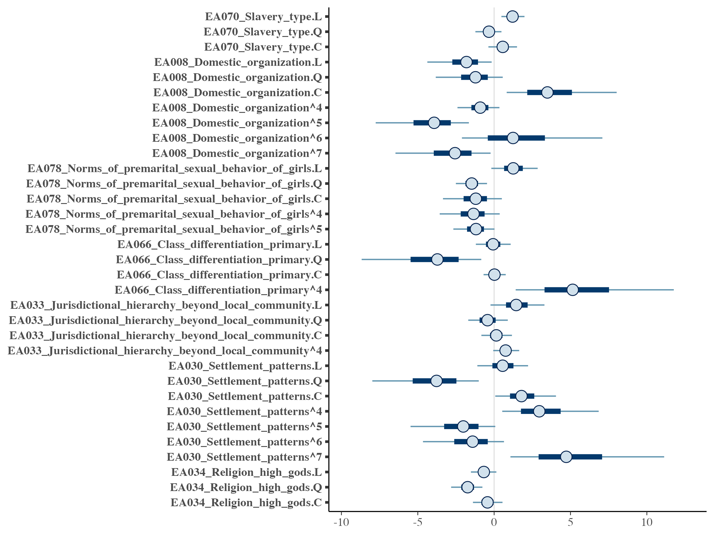

```{r setup, include=FALSE}
knitr::opts_chunk$set(echo = FALSE, warning = FALSE, error = FALSE, message = FALSE, fig.path = 'figures/', fig.width = 8, fig.height = 8)
```

```{r header}
setwd('~/Github/Racz2023trance/')

library(tidyverse)
library(glue)
library(knitr)
library(patchwork)
library(corrplot)
library(ggthemes)
library(ggfortify)
library(ggmap)
library(googlesheets4)
library(broom)

mapWorld = map_data('world', wrap=c(-25,335), ylim=c(-55,75)) # pacific centered

ld = read_tsv('data/dat_long.tsv')
wd = read_tsv('data/dat_wide.tsv')
bf = read_tsv('models/bayes_factors.tsv')
cm1a = read_tsv('models/conf_matrix11model.tsv')
cm1b = read_tsv('models/conf_matrix11test.tsv')
varimp1 = read_tsv('models/varimp11.tsv')
glm1 = read_tsv('models/glm_estimates.tsv')
sccs = filter(ld, in_sccs)
```

# Online supplement: Possession trance co-varies with measures of social rigidity in the Ethnographic Atlas

This is the online supplement for the paper “Possession trance covaries
with measures of social rigidity in the Ethnographic Atlas”. The
current version of the paper is
[here](https://docs.google.com/document/d/1qbcsCeQ-Tw2W-yhQvvYd1Nk5ImQznqWBmiHX09lB_24/edit?usp=sharing). The `helper` file creates the data files. The `model` files run the Gradient Boosting Model and the Bayestraits model, respectively.

We have three questions. What sort of social factors have been proposed to cooccur with trance and possession phenomena? Can we give support to these using the Ethnographic Atlas and the Standard Cross-Cultural Sample? Using phylogenetic comparative methods, can we make claims on the causative structure between the cooccurrent factors?

We expect any effects we find to be relatively modest. This is because trance and possession phenomena result from complex interchanges between individual psychopathology and social organisation, and that, even if we can recognise broader patterns, the effects of social rigidity and marginalisation will be idiosyncratic on the ground. This means that both the outcome (trance and possession) and the predictors (e.g. measures of social rigidity) will be much more inherently variable than in similar analyses.

Here is a map of trance and possession phenomena.

```{r fig.width=8, fig.height=11}
lld = ld %>% 
  filter(var_id == 'EA112') %>% 
  mutate(
    lon2 = ifelse(lon < -20, lon + 360, lon),
    coding = fct_reorder(var_name,code),
    var_description2 = glue('({code}) {var_description}')
  )

p1 = ggplot() + 
  geom_polygon(data = mapWorld, aes(x=long, y = lat, group = group)) + 
  # geom_label(data = lld, aes(x = lon2, y = lat, label = ' ')) +
  geom_point(data = lld, aes(x = lon2, y = lat), colour = '#FFAA00') +
  theme(axis.title.x=element_blank(), axis.text.x=element_blank(), axis.ticks=element_blank(), axis.title.y=element_blank(), axis.text.y=element_blank()) +
  # scale_colour_viridis_d() +
  # guides(colour = 'none',label = 'none') +
  theme_void() +
  facet_wrap( ~ var_description2, nrow = 4, labeller = label_wrap_gen(width = 60, multi_line = T))

p1
```

## 1. Trance and possession phenomena have societal covariates in the literature

The paper says that trance induced by possession is not a random, idiosyncratic pathology but a recurrent psycho-social trait that is at least partly motivated by other social factors. This is recurrent claim in the literature. Here, we revisit the main points of this claim.

High overall social complexity and social rigidity, as well as the resulting power dynamics, might translate to possession trance practices. Such practices might serve to express or relay perceived social inflexibility and inequality. This is echoed in the medical anthropology literature (@during2011critical,@dein2012religion) and ties in with broader questions of inequality and mental health (@nguyen2003anthropology). Various causative models have been proposed to account for the emergence of possession trance, shamanism, and witchcraft in a social setting (@winkelman2015shamanism, @singh2018cultural, @wood2018trance, @singh2021magic).

Some or most groups can feel stuck in a society. If this makes trance and possession more likely, we should see correlations between measures of social complexity, organisation, and inequality and possession and trance in cross-cultural data. Many such correlations have been proposed by previous work. Here is a list, cross-referenced with @wood2018complexity:

| Relationship                                                                             | Reference                |
|:-----------------------------------|:-----------------------------------|
| Social complexity, rigidity, gender role differentiation                                    | @bourguignon1968         |
| Women's social participation                                                             | @bourguignon1973religion |
| Slavery, role differentiation, and structure differentiation | @greenbaum1973           |
| Increased social participation                                | @swanson1978             |
| Social complexity                                     | @winkelman1986           |
| Social flexibility, cognatic kinship                              | @shaara1992              |
| Decreased social participation                                | @douglas2004natural      |
| Social rigidity, monotheism                                                                               | @wood2018complexity      |

Several works made the same point or emphasised various aspects of the same relationship. The above table is somewhat reductive.

Broadly speaking, we have measures of:

1. Social complexity (including monotheism, which we assume to be more prevalent in more complex societies, see @botero2014ecology)
2. Social rigidity (including cognatic kinship, which @shaara1992 uses as an example of a more flexible social blueprint)
3. Social participation, with an emphasis on gender roles in social activites, including work.

## 2. This can be mapped to the Ethnographic Atlas

The use of cross-cultural typological data in general and the Ethnographic Atlas in particular has precedents. @bourguignon1968, @bourguignon1973religion, and @greenbaum1973 use the Ethnographic Atlas to look for correlates of trance and possession trance. @wood2018complexity, @shaara1992, @winkelman1986, and @douglas2004natural build on this research by specifying and compiling their own data sets. The present paper uses the Ethnographic Atlas as made available in the D-Place database, @kirby2016d.

What is our outcome variable? The Atlas records the presence of trance and possession phenomena in a given society, using the following variable (EA112):

```{r }
trance = sccs %>% 
  filter(var_id == 'EA112') %>% 
  count(var_name,code,var_description) %>% 
  rename(name = var_name, description = var_description, "n in SCCS" = n) %>% 
  mutate(
    possession_trance = case_when(
      code %in% c(3,4,6,7) ~ 'possession trance',
      code %in% c(1,2,8,5) ~ 'other'
    ) %>% 
      fct_relevel('possession trance')
  )

table1 = ld %>% 
  filter(var_title == 'Trance states', !is.na(code)) %>% 
  count(code, var_description, name = 'n in EA') %>% 
  left_join(trance) %>% 
  arrange(code) %>% 
  rename(Coding = code, Description = var_description) %>% 
  select(Coding,Description,possession_trance,`n in EA`,`n in SCCS`) 

#write_sheet(table1, ss = 'https://docs.google.com/spreadsheets/d/1X7ZCnw6LVhjLIy4SiSeK3iZ6o1S144iHMv4DqOaCDEU/edit#gid=0', sheet = 'Table 1') 

table1 %>% 
  kable('simple')
```

This is basically a truth table of whether possession beliefs or trance states are present in a given society, with some causal links between the two (if possession happens it leads to trance, if trance happens it is because of possession, etc.). We can think of different groupings: trance phenomena encompass levels 1,3,4,5,6,7, possession phenomena encompass 2,3,4,5,6,7, specifically possession trance covers 3,4,6,7 but not 1,2,5,8. Following @bourguignon1968, we reduce the complexity of the outcome variable to two levels: whether a society has *possession trance* or not.

```{r }
trance %>% 
  group_by(possession_trance) %>% 
  summarise(count = sum(`n in SCCS`)) %>% 
  kable('simple')
```

What are our predictor variables? The Atlas lists a set of variables that tie in with the observed covariates in the literature. These are either taken literally from @bourguignon1968, @bourguignon1973religion, and @greenbaum1973 or adapt variables used by @wood2018complexity, @shaara1992, @winkelman1986, and @douglas2004natural.

Variables 8, 30:33, 66, 68, 70, 72, 73 were lifted from previous work, most notably @bourguignon1968 and @greenbaum1973. In addition, Variables 15, 23, 27, 74, 113 were taken as approximations for social rigidity, while variables 53, 54, 78 for participation, based on the literature above.

```{r eval = F}
pred_table = ld %>% 
  filter(var_title != 'Trance states') %>% 
  distinct(var_id,var_title,var_definition) %>%
  arrange(var_id) %>% 
  rename(ID = var_id, Name = var_title, Definition = var_definition)

write_tsv(pred_table, 'data/pred_table_temp.tsv')
```

```{r }
pred_table = read_tsv('data/pred_table_added.tsv')

#write_sheet(pred_table, ss = 'https://docs.google.com/spreadsheets/d/1X7ZCnw6LVhjLIy4SiSeK3iZ6o1S144iHMv4DqOaCDEU/edit#gid=0', sheet = 'Table 3')

pred_table %>% 
  kable('simple')
```

## 3. How do we look for correlations between possession trance and its proposed societal covariates?

There are eight types of trance and possession phenomena recorded in the Atlas and a wide set of possible covariates, all with a number of levels (see the Appendix).

The data are challenging in two ways. The variables are themselves correlated, either because they measure different facets of the same thing (like how complex a society is; see the figure below) or because they were adapted together by socially or geographically close societies (Galton's problem). In addition, data are missing from the Atlas in a non-random manner (e.g. if a society is hard to access, it is harder to provide a population size estimate for it). The correlations of the pairwise complete observations of the relevant predictors in the Ethnographic Atlas can be seen below.

```{r }
cord = ld %>% 
  filter(!var_title %in% c('Trance states','Societal rigidity')) %>% 
  select(soc_id,var_title,code) %>%
  pivot_wider(id_cols = soc_id, names_from = var_title, values_from = code) %>% 
  select(-soc_id)

cor(cord,use="pairwise.complete.obs") %>% 
  corrplot()

```

We can account for Galton's problem (geographic and cultural co-variation) by restricting our initial data to societies in the Standard Cross-Cultural Sample.

The remaining co-variation and the non-random patterns of missing data recommend an ensemble learning method. This starts with societies that have information on trance and possession phenomena. It then builds a lot of tiny models, using random samples of the data and random subsets of the covariates. Then, we compare the tiny models with each other to assess the overall importance of our covariates. Building tiny models in parallel is called bagging. This is how a random forest works, growing many classification or regression trees and aggregating over the results. One step further is to train models on the mistakes of the previous models. This is called [boosting](https://www.ibm.com/cloud/learn/boosting) and usually results in higher training and prediction accuracy.

## 4. Building a boosting model

In this analysis, we will use a gradient boosting model on the data from the Ethnographic Atlas, subsetting it to only include societies in the Standard Cross-Cultural Sample.

Gradient boosting is an ensemble learning method which uses decision trees. A decision tree is a directed tree graph in which each node represents a decision or split based on a predictor variable and each leaf is an individual data point. It can be used to classify leaves by grouping them under different node structures. A gradient boosting algorithm fits such trees in a sequence, training each on the errors of the previous one, minimising overall error. It stops when further iterations do not result in meaningful improvement on model accuracy (according to pre-set criteria) [@cook2016practical,@rhys2020machine,@smith2017decision].

We only fit the model on societies which (a) have information on whether trance and possession phenomena are present and (b) come from the standard cross-cultural sample.

The predictors are the possible covariates identified above. Some predictors, like `EA032` (Jurisdictional hierarchy of local community) or `EA113` can be construed to follow a scale. These are input as *ordered factors*. Others, like `EA053` (Sex differences in animal husbandry) or `EA043` (Major type of descent) can be carved up into categories: These are *one-hot encoded*. For details, see the Appendix.

We use *hyperparameter tuning* to find the best possible model.  The model is fit on a training set of `r length(unique(sccs$soc_id))` societies with information on trance and possession in the standard cross-cultural sample. The hyperparameter grid is printed in the Appendix. 

## 5. Results on the training sample

Looking back at the table in the previous section, we see that only about 10% of societies have no trance or possession phenomena. From the rest, a majority have possession trance in some form. Following @bourguignon1968 we can reduce this to a binary: 81 societies have possession trance, 70 have other forms of trance and possession or show neither.

We compare training information on each society with how our best model categorises each society. This is our model's confusion matrix. `0` is absence of possession trance, `1` is presence of possession trance. The rows add up to values in the original, the columns are the model's predictions. The last two columns show the error rate. For example, there are 71 societies in the Standard Cross-Cultural Sample that have possession trance, out of these, the model thinks 64 have possession trance and 7 do not (second row). This is an error rate of 7/71=.1.

```{r }

table4 = cm1a %>% 
  mutate(original = c(names(cm1a)[!names(cm1a) %in% c('Error','Rate')],'Total')) %>% 
  relocate(original)

#write_sheet(table4, ss = 'https://docs.google.com/spreadsheets/d/1X7ZCnw6LVhjLIy4SiSeK3iZ6o1S144iHMv4DqOaCDEU/edit#gid=0', sheet = 'Table 4')

table4 %>% 
  kable('simple', digits = 2)

# precision = true 1/tru1 + false 1
# recall = true 1/true1 + false0
precision = 64 / (64+12)
recall = 64 / (64+7)
f = (2 * precision * recall) / (precision + recall)
```

The model has an F-measure of `r round(f,2)`, with a penalty on slightly overgeneralising possession trance. Though such comparisons are hard to make, this is not particularly accurate for a binary categorisation problem. This is not surprising -- it is unlikely that any complex cultural phenomenon could be reduced to a small number of cross-cultural predictors.

We can put a p value on these by using a Chi-squared test:

```{r }
chisq.test(c(c(68,12),c(7,64))) %>% 
  tidy() %>% 
  kable('simple', digits = 2)
```

The model is above chance in predicting its training data.

### 6. Results on the EA data

We can ask the model to make predictions for the entire Ethnographic Atlas (where trance and possession data are available) -- including the Standard Cross-Cultural Sample subset. Generally, you want to separate the training and test sets in Machine Learning and not do this, but the 'everything except the Standard Cross-Cultural Sample' subset of the Atlas would be an odd test set.

Here is the confusion matrix for all `r length(unique(ld$soc_id))` societies in the Atlas where trance and possession information are available:

```{r }

cm1b %>% 
  kable('simple')

#write_sheet(cm1b, ss = 'https://docs.google.com/spreadsheets/d/1X7ZCnw6LVhjLIy4SiSeK3iZ6o1S144iHMv4DqOaCDEU/edit#gid=0', sheet = 'Table 5')

# precision = true 1/true1+false 1
# recall = true 1/true1 + false0
precision2 = 194 / (194+113)
recall2 = 194 / (194+87)
f2 = (2 * precision2 * recall2) / (precision2 + recall2)

```

The F-measue of this model is `r round(f2,2)`. Accuracy here is much worse than for the training data only. That is partly due to model bias and at least partly because the model is ignorant of the phylogenetic signal which might result in patterns that are unexpected from a purely correlational point of view. However, the model is still more accurate than it would be by chance.

We can put a p value on these as well by using a Chi-squared test:

```{r }
chisq.test(c(c(264,113),c(87,194))) %>% 
  tidy() %>% 
  kable('simple', digits = 2)
```

The model is above chance in predicting its test data.

We now take a look at the variables that were important in the model itself in predicting the presence of possession trance in a given society, with a cutoff of 10/47 most important variables. 

```{r }
vars = ld %>% 
  filter(var_title != 'Trance states') %>% 
  distinct(var_id,var_title,var_definition,var_name) %>%
  arrange(var_id) %>% 
  group_by(var_id, var_title, var_definition) %>% 
  nest() %>% 
  mutate(levels = map(data, ~ paste(.$var_name, collapse = ', '))) %>% 
  select(var_id, var_title, levels) %>% 
  unnest(cols = c(levels)) %>% 
  rename(ID = var_id, Name = var_title)

vars2 = varimp1 %>% 
  slice(1:10) %>% 
  mutate(ID = str_extract(variable, '^EA...')) %>% 
  left_join(vars, by = "ID") %>% 
  select(ID, Name, relative_importance)

#write_sheet(vars2, ss = 'https://docs.google.com/spreadsheets/d/1X7ZCnw6LVhjLIy4SiSeK3iZ6o1S144iHMv4DqOaCDEU/edit#gid=0', sheet = 'Table 6')  

vars2 %>% kable(digits = 2, 'simple')
```

Before we cross-reference the results with the claims in the literature, we look at the direction of these effects (does e.g.\ increased jurisdictional hierarchy go with more or less prevalent possession trance?). Then we ask questions about co-occurrence versus co-evolution.

The figure below shows the proportion of societies with possession trance (dark blue) and without (light blue) across the ordered levels of the predictors. These are the predictors that the model thinks are important. They come in order of how important they are, according to the model; prevalence of slavery, then family organisation, and so on. The predictor levels are ordered according to coding and generally go from a pattern being less complex or prevalent (top) to more complex or prevalent (bottom). So, for domestic organisation (top right) we go from small nuclear to large extended families. For slavery (top left) we go from absence of slavery to hereditary slavery.

We see a clear correlation between the presence of possession trance and the variable scaling up. E.g. societies in which slavery is more prevalent are more likely to have possession trance than those where it is less prevalent. Societies with more complex extended families are more likely to have possession trance. The across-level distributions are also interesting, e.g. the main distinction for patterns of slavery is for societies without slavery (first factor level) and all others with some form of slavery (subsequent factor levels).

```{r fig.width=10,fig.height=16}
d_out = ld %>% 
  filter(var_id == 'EA112') %>% 
  mutate(
    `possession trance` = case_when(
      code %in% c(3,4,6,7) ~ 'present',
      code %in% c(1,2,5,8) ~ 'absent'
        )
      ) %>% 
  select(soc_id,`possession trance`)

d_in = ld %>%
  filter(var_title %in% vars2$Name, !is.na(code)) %>% 
  mutate(
    recoded_value2 = case_when(
      var_title == 'Inheritance rule for real property (land)' ~ as.double(code),
      var_title != 'Inheritance rule for real property (land)' ~ as.double(recoded_value)
    ),
    predictor = fct_reorder(var_name, -recoded_value2),
    inv_value = -as.integer(recoded_value),
    var_title = fct_relevel(var_title, vars2$Name)
    ) %>% 
  select(soc_id,var_definition,var_title,predictor)

d_vis = inner_join(d_in,d_out, by = 'soc_id')

plots = d_vis %>%
  count(var_title,predictor,`possession trance`) %>% 
  group_by(var_title) %>% 
  nest() %>% 
  mutate(
    plot = map2(var_title, data, ~ 
                  ggplot(.y, aes(predictor,n,fill = `possession trance`)) +
                  geom_col(position = 'dodge') +
                  theme_bw() +
                  theme(axis.title=element_blank()) +
                  # guides(fill = 'none') +
                  scale_fill_brewer(palette = "Paired") +
                  ggtitle(str_wrap(.x, width = 25)) +
                  coord_flip()
                 )
  ) %>% 
  pull(plot)
  
wrap_plots(plots, ncol = 2) + plot_layout(guides = "collect") & theme(legend.position = 'bottom')
```

Let's step back for a second. How do we know that these effects are present beyond cultural autocorrelation? Our tree model was fit on the Standard Cross-Cultural Sample, which attempts to control for cultural autocorrelation. Another thing we can do is fit a model on the Ethnographic Atlas data but account, to some extent, for autocorrelation. This is difficult. We can take the seven best predictors from our tree model. These already account for over 75% of the explained variation. Then, we can take the observations from the Atlas that have data for all seven variables. This is 283/658 societies that have data on possession trance in the first place. We can then fit a Bayesian hierarchical logistic regression model with a grouping factor for geographic region and for language family. There is a trade-off here. If we include more predictor variables, we have fewer societies with complete data. If we use more complex measures to account for autocorrelation, we will eventually overfit the model. This implementation is one of the less suboptimal ones.

In the resulting fit, we see that six of the seven predictors have a robust effect on the outcome, with a 95% credible interval that excludes zero. All of the predictors are ordered categories and sometimes the effect is linear, sometimes it's quadratic, or cubic. The exception is premarital sexual norms for girls (EA078).



Is this because EA078 is a false positive, once we consider autocorrelation in a different way? It is hard to say: Maybe the effect is more robust across all societies, but these will not have data for some or all of the other predictors. Clearly, there are a lot of analytic decisions to make here and there is no optimal solution. Since the main hypothesis of this paper touches on social rigidity more generally, questions about one predictor will not necessary sink the entire project.

## 7. Did these traits develop independently?

The literature makes causative claims: societal rigidity causes possession trance (and not the other way round). Cross-cultural correlations can be indicative of causative structure but cannot provide direct evidence for it. 

In addition, we can look at the cultural evolution of the outcome and some of the predictor variables. We take two examples, slavery and domestic organisation. If the practice of slavery leads to possession trance, we expect them to (i) correlate in the ethnographic record (they do) and emerge together in cultural phylogenies. 

To test for this, we select two predictors, slavery and domestic organisation. These are the two strongest predictors in our cross-cultural analysis. We recode them as binaries to reflect their relationship to prevalence of possession trance: For prevalence of slavery, 1 is any form of slavery present in a cultural group, 0 is no slavery attested. For domestic organisation, 1 is nuclear family organisation, 0 is larger extended family organisation. Our outcome is 1 where possession trance is present and 0 where it is absent.

We select two phylogenies, Austronesian and Bantu. We use BayesTraits to assess the co-evolution of predictors and outcome (@pagel2007bayestraits). We fit two models, an independent model, which assumes that two traits evolve independently, and a dependent model, which assumes that traits are correlated and the rate of change in one trait. is dependent on the state of the other trait. 

Four dependent and four independent models are fit, for the relationship of (i) possession trance and the presence of slavery, (ii) possession trance and nuclear/extended family organisation across the three phylogenies.

Phylogenies come from D-Place which stores these for the original publications. Societies are matched to phylogenetic trees by language ID-s. Societies that have no data on both traits are pruned from the phylogenetic trees. 

Models are fit using Markov Chain Monte Carlo using exp(10) priors, 100 stepping stones, and 1000 iterations per stone. Each run provides a marginal likelihood for the model fit.

We calculate the Bayes Factors for the more complex dependent versus the less complex independent models. A higher value for a Bayes Factor indicates that the more complex model provides a better fit and so its complexity is justified. The Bayes Factors for the four model comparisons can be seen below.

bayes factor
```{r }
#write_sheet(bf, ss = 'https://docs.google.com/spreadsheets/d/1X7ZCnw6LVhjLIy4SiSeK3iZ6o1S144iHMv4DqOaCDEU/edit#gid=0', sheet = 'Table 7')
kable(bf, 'simple', digits = 2)
```

The results mostly suggest that possession trance and slavery as well as nuclear family organisation developed independently across the two phylogenies. Overall, there is little evidence here for trait co-evolution.

The phylogenetic comparative analysis concedes with a large number of limitations. It remains true that it does not lend additional support to the cross-cultural analysis.

## 8. Summary

The overall results go some way in confirming hypotheses on the cross-cultural correlates of possession trance in the literature. @bourguignon1968 explicitly tests the variables of domestic organisation slavery, jurisdictional hierarchy, settlement patterns, and kin groups. @shaara1992 point to a high value placed on female virginity at marriage, captured here by norms of premarital sexual behaviour for girls, @wood2018complexity point to the role of moralising high gods. These are all important variables in our cross-cultural model. @greenbaum1973 and @shaara1992 point to sexual division of labour but this is not relevant in our model.

Note that @shaara1992 use cognatic kinship as a proxy of social complexity (which in itself is robustly supported by our model) while the measure referenced by @wood2018complexity, the presence of moralising high gods, has in itself been argued to correlate with social complexity (see @botero2014ecology and @watts2015broad).

This brings us back to the original predictions in the table above.

| Relationship|Reference|Our model|
|:-|:-|:-|
|less complexity$\rightarrow{}$trance w/o possession|@bourguignon1968|the same measures of complexity are relevant|
|women's social participation|@bourguignon1973religion|labour divisions are not relevant|
|increased role differentiation and slavery practices$\rightarrow$trance and possession|@greenbaum1973|slavery, social and class complexity are relevant|
|main mode of subsistence|@bourgouignon1977|not relevant|
|increased social participation$\rightarrow{}$possession|@swanson1978|indirectly, through domestic and social complexity|
|more complexity$\rightarrow{}$trance w/ possession|@winkelman1986|yes, see above|
|cognatic kinship$\rightarrow{}$more possession and trance|@shaara1992|not directly|
|decreased social participation$\rightarrow{}$possession|@douglas2004natural|yes, see above|
|monotheism|@wood2018complexity|yes|

We can predict some types of trance and possession phenomena in the Standard Cross-Cultural Sample subset of the Ethnographic Atlas. Not all of them. Some of the important co-variates are the ones mentioned by earlier work and the direction of the relationships corroborates the literature. Phylogenetic comparative methods do not provide additional support to attested cross-cultural co-variation.

Human society is complicated and cross-cultural data have very low resolution. In this sense, we'd be suspect of a model that would be too accurate of predicting possession trance from societal covariates. It cannot replace fieldwork and more complex explanatory models. It can provide an extra leg for such explanatory work, which is the recognised ambition of cross-cultural comparative work in evolutionary anthropology.

Our approach is statistically strict, so the fact that it still shows some accuracy is definitely promising for the validity of the connections drawn by previous work on trance and possession phenomena in particular and large cross-cultural comparisons in general.

## 9. Limitations

The cross-cultural model is fit on the Standard Cross-Cultural Sample which does not minimise the phylogenetic signal completely (see [here](https://excd.org/2018/03/01/stats-corner-is-the-standard-cross-cultural-sample-really-standard/)). The data in the Ethnographic Atlas cannot be independently verified. The outcome variable and the predictors are selected and defined with the existing literature in mind. It remains true that these decisions use up a large amount of researcher degrees of freedom. This is especially true for the phylogenetic comparative analysis, which further reduces resolution on the co-varying traits as a starting point. 

Such limitations will be in place for all cross-cultural analyses. They are exacerbated here by the elusiveness of the variables themselves, which likely results in more starting variability baked into the Ethnographic Atlas coding in the first place. The accompanying statistical rigour might render this work relevant to the broader study of trance and possession, despite these limitations.

## Appendix

### Relevant predictors in the Ethnographic Atlas

A survey of the literature resulted in the following predictors of trance and possession phenomena.

```{r }
kable(vars, 'simple')
```

### Recoded values in the Ethnographic Atlas

The recoded values were used in the model for each predictor. Where the recoded values are numeric, the predictor was used as an ordered factor. Where the recoded values are strings, the predictor was one-hot encoded (such that predictor A with levels 1, 2, and 3 was turned into boolean predictors A==2 and A==3).

```{r }
coding_table = ld %>% 
  filter(var_id != 'EA112') %>% 
  distinct(var_id,var_title,var_description,recoded_value) %>% 
  arrange(var_id,recoded_value)

coding_table %>% 
  kable('simple')

# write_sheet(coding_table, ss = 'https://docs.google.com/spreadsheets/d/1X7ZCnw6LVhjLIy4SiSeK3iZ6o1S144iHMv4DqOaCDEU/edit#gid=0', sheet = 'Table 9')

```

### Hyperparameter values for the Gradient Boosting Model

```{r, echo=T}
gbm_params1 = list(
  learn_rate = c(0.01,0.02,0.03,0.1),
  max_depth = c(1,3,5,7),
  sample_rate = c(0.4,0.7,0.9,0.95),
  col_sample_rate = c(0.1,0.2,0.3),
  min_split_improvement = c(1e-3,1e-5)
)

```

## References
