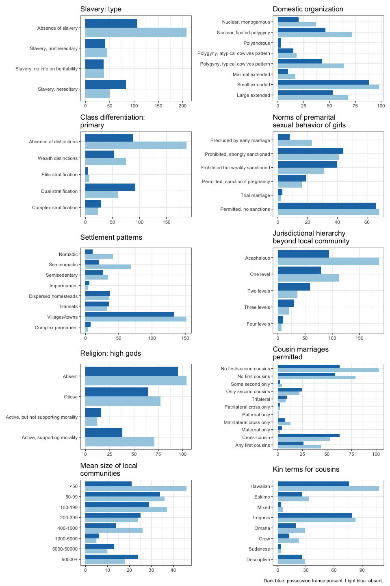

We want to look at two questions. What sort of social factors have been
proposed to cooccur with trance and possession phenomena? Using the
Ethnographic Atlas and the Standard Cross-Cultural Sample, can we get
more confident that these factors do cooccur with such phenomena across
cultures?

## 1. Trance and possession phenomena have societal covariates in the literature

Many people have argued that trance induced by possession is not a
random, idiosynchratic pathology but a recurrent psychosocial trait that
is at least partly motivated by other social factors.

High overall social complexity and social rigidity – the resulting power
dynamics – might translate to possession trance practices. Such
practices might serve to express or relay perceived social inflexibility
and inequality. This is echoed in the medical anthropology literature
(During et al. (2011),Dein, Cook, and Koenig (2012)) and ties in with
broader questions of inequality and mental health (Nguyen and Peschard
(2003)). Various causative models have been proposed to account for the
emergence of possession trance and, specifically, shamanism in a social
setting (M. Winkelman (2015), Singh (2018), C. Wood et al. (2018)).

Some or most groups can feel stuck in a society. If this makes trance
and possession more likely, we should see correlations between measures
of social complexity, organisation, and inequality and possession and
trance in cross-cultural data. Many such correlations have been proposed
by previous work. Here is a list, cross-referenced with C. P. Wood and
Stockly (2018):

| Relationship                                                                 | Reference                     |
|:-----------------------------------|:-----------------------------------|
| less complexity  →  trance w/o possession                                    | Bourguignon (1968)            |
| women’s social participation                                                 | Bourguignon (1973)            |
| increased role differentiation and slavery parctices → trance and possession | Greenbaum (1973)              |
| main mode of subsistence                                                     | Bourguignon and Evascu (1977) |
| increased social participation  →  possession                                | Swanson (1978)                |
| more complexity  →  trance w/ possession                                     | M. J. Winkelman (1986)        |
| cognatic kinship  →  more possession and trance                              | Shaara (1992)                 |
| decreased social participation  →  possession                                | Douglas (2004)                |
| monotheism                                                                   | C. P. Wood and Stockly (2018) |

Several works made the same point or emphasised various aspects of the
same relationship. The above table is a bit reductive.

It’s an entirely different question whether we can build more ambitious
explanatory models that link possession trance and similar practices to
e.g. social inequality. This is not a question we really want to deal
with here. What we want to know is whether the above descriptions are
accurate at all, when given closer scrutiny. We can answer this question
by looking at a cross-cultural data set, the Ethnographic Atlas, to see
if we can attest in it any of the correlations proposed in the
literature.

## 2. This can be mapped to the Ethnographic Atlas

We find data on trance and possession phenomena and their various
proposed covariates in the Ethnographic Atlas (Murdock 1967) (we use the
version made available in the D-Place database, Kirby et al. (2016)).

The Atlas records the presence of trance and possession phenomena in a
given society, using the following variable (EA112):

| coding | Description                                                                                                                                                                                                                                    |
|-------:|:-----------------------------------------------------------------------------------------------------------------------------------------------------------------------------------------------------------------------------------------------|
|      1 | Trance behavior is known to occur, but there is no belief in possession.                                                                                                                                                                       |
|      2 | A belief in possession exists.                                                                                                                                                                                                                 |
|      3 | Trance behavior is known to occur and is explained as due to possession. There is no possession belief referring to other experiences and there are no trance states with other explanations.                                                  |
|      4 | Two types of trance states are known to occur. One which is explained as due to possession and one which is given another type of explanation. In addition to explaining trance, possession belief also refers to one or more other phenomena. |
|      5 | There is both a trance state and a belief in possession, but this belief refers to phenomena other than trance, which is explained through other categories.                                                                                   |
|      6 | Trance explained as due to possession is known to occur, and there are no other trance states, but cases of possession outside of trance are also believed to occur.                                                                           |
|      7 | Trance states of two kinds are known to occur, some of which are explained by possession. No other phenomena are explained by possession.                                                                                                      |
|      8 | No trance states of any kind are known to occur, and there is no belief in possession.                                                                                                                                                         |

This is basically a truth table of whether possession beliefs or trance
states are present in a given society, with some causal links between
the two (if possession happens it leads to trance, if trance happens
it’s because of possession, etc). We can think of different groupings
(trance phenomena encompass levels 1,3,4,5,6,7, possession phenomena
encompass 2,3,4,5,6,7, specifically possession trance covers 3,4,6,7 but
not 1,2,5,8).

The eight levels here likely result from a trade-off between description
accuracy and generalisability that is present throughout the Atlas. It
is unlikely that eight descriptions suffice to capture the plethora of
phenomena related to trance and possession. But largely the same is true
for all variables in the Atlas. This hasn’t stopped people from doing
large-scale comparative studies before!

The Atlas lists a set of variables that tie in with the observed
covariates in the literature. Here are some relevant-looking ones:

| ID    | Name                                            | Definition                                                                                                                                                                                                                                                                                                                                                                                                                                                                                                                                                                                                                                                                      |
|:------|:------------------------------------------------|:--------------------------------------------------------------------------------------------------------------------------------------------------------------------------------------------------------------------------------------------------------------------------------------------------------------------------------------------------------------------------------------------------------------------------------------------------------------------------------------------------------------------------------------------------------------------------------------------------------------------------------------------------------------------------------|
| EA008 | Domestic organization                           | The prevailing form of domestic or familial organization.                                                                                                                                                                                                                                                                                                                                                                                                                                                                                                                                                                                                                       |
| EA012 | Marital residence with kin: prevailing pattern  | The prevailing profile of marital residence in the society.                                                                                                                                                                                                                                                                                                                                                                                                                                                                                                                                                                                                                     |
| EA015 | Community marriage organization                 | The prevalence of local endogamy, agamy, and exogamy, together with the presence or absence of localized kin groups. The specific structure of clans, whether ambilocal, matrilocal, or patrilocal, is revealed by the variable describing prevailing patterns of residence with kin.                                                                                                                                                                                                                                                                                                                                                                                           |
| EA023 | Cousin marriages permitted                      | The rules or practices governing the marriageability or nonmarriageability of a man’s first cousins and, in some cases, second cousins.                                                                                                                                                                                                                                                                                                                                                                                                                                                                                                                                         |
| EA027 | Kin terms for cousins                           | Extent to which names for cousins distinguish cousin subtypes and/or among other groups of kin.                                                                                                                                                                                                                                                                                                                                                                                                                                                                                                                                                                                 |
| EA030 | Settlement patterns                             | The prevailing type of settlement pattern.                                                                                                                                                                                                                                                                                                                                                                                                                                                                                                                                                                                                                                      |
| EA031 | Mean size of local communities                  | The average population of local communities, whatever the pattern of settlement, computed from census data or other evidence.                                                                                                                                                                                                                                                                                                                                                                                                                                                                                                                                                   |
| EA032 | Jurisdictional hierarchy of local community     | The number of jurisdictional levels in the local community, with 2 representing the theoretical minimum (e.g., independent nuclear or polygynous families) and 4 representing the theoretical maximum (e.g., nuclear families nested within extended families and clan-barrios). See the variable ““Jurisdictional hierarchy beyond the local community”” for information on organization beyond the local community. Note that different types of organization on the same level, e.g., a consanguineal lineage and its localized equivalent, are counted as one, and organizations not held to be legitimate, e.g., imposed colonial regimes, are excluded.                   |
| EA033 | Jurisdictional hierarchy beyond local community | The number of jurisdictional levels beyond the local community, with 1 representing the theoretical minimum (e.g., none/autonomous bands or villages) and 4 representing the theoretical maximum (e.g., villages nested within parishes, districts, provinces, and a complex state). This variable also provides a measure of political complexity, ranging from 1 for stateless societies, through 2 or 3 for petty and larger paramount chiefdoms or their equivalent, to 4 or 5 for large states. Note that different types of organization on the same level are counted as one, and organizations not held to be legitimate, e.g., imposed colonial regimes, are excluded. |
| EA034 | Religion: high gods                             | The range of beliefs in high gods. A high god is defined, following Swanson, as a spiritual being who is believed to have created all reality and/or to be its ultimate governor, even if his sole act was to create other spirits who, in turn, created or control the natural world.                                                                                                                                                                                                                                                                                                                                                                                          |
| EA042 | Subsistence economy: dominant activity          | Dominant mode of subsistence (note: not in original EA; derived from other variables on subsistence and type of agriculture).                                                                                                                                                                                                                                                                                                                                                                                                                                                                                                                                                   |
| EA043 | Descent: major type                             | Major mode of descent (note: not in original EA; derived from variables describing patrilineal and matrilineal kin groups EA017, EA019 and EA021).                                                                                                                                                                                                                                                                                                                                                                                                                                                                                                                              |
| EA066 | Class differentiation: primary                  | The degree and type of class differentiation, excluding purely political and religious statuses. See also ““Class differentiation: secondary,”” as some societies exhibit important features of two different types of class differentation.                                                                                                                                                                                                                                                                                                                                                                                                                                    |
| EA068 | Caste differentiation: primary                  | The degree and type of caste differentiation. See also ““Caste differentiation: secondary,”” as some societies exhibit important features of two different types of caste differentation.                                                                                                                                                                                                                                                                                                                                                                                                                                                                                       |
| EA070 | Slavery: type                                   | The forms and prevalence of slave status, treated quite independently of both class and caste status.                                                                                                                                                                                                                                                                                                                                                                                                                                                                                                                                                                           |
| EA072 | Political succession                            | Rules of succession applying to the office of local headman (or a close equivalent), without reference to rules of succession prevailing on higher levels of political integration.                                                                                                                                                                                                                                                                                                                                                                                                                                                                                             |
| EA074 | Inheritance rule for real property (land)       | The rule or practice governing the disposition or transmission of a man’s property in land (exclusive of any dower right of his widow). \[Note that Murdock (1963a) warned that the codes for this variable had ““proved inadequate and in serious need of revision,”” and that the coded data ““should consequently be used only with circumspection””\].                                                                                                                                                                                                                                                                                                                      |
| EA078 | Norms of premarital sexual behavior of girls    | Prevailing standards of sex behavior for unmarried women.                                                                                                                                                                                                                                                                                                                                                                                                                                                                                                                                                                                                                       |
| EA113 | Societal rigidity                               | Degree of rigidity in social structures. Considers stratification of society, whether status distinctions are earned or ascribed, degree of hierarchy of political system, extent to which residence and group membership are fixed, centralization of authority, flexibility of religious rites.                                                                                                                                                                                                                                                                                                                                                                               |

The covariates in the literature do not directly map on the variables in
the Atlas. The variables are themselves correlated, either because they
measure different facets of the same thing (like how complex a society
is) or because they were adapted together by socially or geographically
close societies (Galton’s problem).

## 3. How do we look for correlations between trance and possession and their proposed societal covariates?

We could table how often trance and possession phenomena and their
posited covariates pattern together. This is generally a bad idea.

There are eight types of trance and possession phenomena recorded in the
Atlas (and we can make up new codings!) and a wide set of possible
covariates, all with a number of levels:

| ID    | Name                                            | levels                                                                                                                                                                                                                      |
|:------|:------------------------------------------------|:----------------------------------------------------------------------------------------------------------------------------------------------------------------------------------------------------------------------------|
| EA008 | Domestic organization                           | Small extended, Nuclear, monogamous, Nuclear, limited polygyny, Polygyny, atypical cowives pattern, Polygyny, typical cowives pattern, Large extended, Minimal extended, Missing data, Polyandrous                          |
| EA012 | Marital residence with kin: prevailing pattern  | Ambilocal, Patrilocal, Ambi-viri, Virilocal, Avunculocal, Avuncu-virilocal, Avuncu-uxorilocal, Matrilocal, Neolocal, Separate, Ambi-uxo, Uxorilocal, Missing data                                                           |
| EA015 | Community marriage organization                 | Exogamous, Clans, Agamous, Segmented, no exogamy, Missing data, Segmented, exogamy, Demes                                                                                                                                   |
| EA023 | Cousin marriages permitted                      | No first/second cousins, No first cousins, Cross-cousin, Any first cousins, Only second cousins, Matrilateral cross only, Patrilateral cross only, Trilateral, Missing data, Maternal only, Some second only, Paternal only |
| EA027 | Kin terms for cousins                           | Eskimo, Omaha, Iroquois, Descriptive, Hawaiian, Mixed, Missing data, Crow, Sudanese                                                                                                                                         |
| EA030 | Settlement patterns                             | Nomadic, Missing data, Dispersed homesteads, Complex permanent, Hamlets, Semisedentary, Villages/towns, Impermanent, Seminomadic                                                                                            |
| EA031 | Mean size of local communities                  | \<50, 100-199, Missing data, 5000-50000, 400-1000, 50-99, 200-399, 50000+, 1000-5000                                                                                                                                        |
| EA032 | Jurisdictional hierarchy of local community     | Extended families, Independent families, Missing data, Clan-barrios                                                                                                                                                         |
| EA033 | Jurisdictional hierarchy beyond local community | Acephalous, One level, Missing data, Two levels, Three levels, Four levels                                                                                                                                                  |
| EA034 | Religion: high gods                             | Active, but not supporting morality, Absent, Missing data, Otiose, Active, supporting morality                                                                                                                              |
| EA042 | Subsistence economy: dominant activity          | Gathering, Hunting, Pastoralism, Extensive agriculture, Two or more sources, Intensive agriculture, Agriculture, type unknown, Fishing                                                                                      |
| EA043 | Descent: major type                             | Bilateral, Patrilineal, Duolateral, Quasi-lineages, Mixed, Matrilineal, Ambilineal, Missing data                                                                                                                            |
| EA066 | Class differentiation: primary                  | Absence of distinctions, Wealth distinctions, Dual stratification, Elite stratification, Missing data, Complex stratification                                                                                               |
| EA068 | Caste differentiation: primary                  | Absence of distinctions, Ethnic stratification, Missing data, Despised occupation groups, Complex caste stratification                                                                                                      |
| EA070 | Slavery: type                                   | Absence of slavery, Slavery, nonhereditary, Slavery, hereditary, Slavery, no info on heritability, Missing data                                                                                                             |
| EA072 | Political succession                            | Patrilineal heir, Nonhered: inf. consensus, Absence of office, Missing data, Nonhered: appointed by auth., Matrilineal heir, Nonhered: seniority, Nonhered: election, Nonhered: influence                                   |
| EA074 | Inheritance rule for real property (land)       | No inher. of real property, Patrilineal by sons, Missing data, Matrilineal by sister’s sons, Matrilineal by heirs, Patrilineal by heirs, Children, less for daughters, Children                                             |
| EA078 | Norms of premarital sexual behavior of girls    | Precluded by early marriage, Missing data, Permitted, sanction if pregnancy, Permitted, no sanctions, Prohibited but weakly sanctioned, Prohibited, strongly sanctioned, Trial marriage                                     |
| EA113 | Societal rigidity                               | Flexible, Missing data, Rigid                                                                                                                                                                                               |

Even if we initially restrict ourselves by a hypothesis, if we keep
trying all the possible combinations, we are bound to find something. In
addition, data are missing from the Atlas in a non-random manner
(e.g. if a society is hard to access, it is harder to provide a
population size estimate for it). This makes any catch even more
spurious.

We could assess the probability of all eight descriptions in the Atlas
together by using a multinomial model. But because data are missing for
the covariates and because the covariates are themselves correlated, a
single model will be wasteful (losing all the observations for which
data are missing) and badly fit (with a lot of colinear predictors in
it). We’re probably better off building a lot of models and then
aggregating over them to find the most important covariates of trance
and possession phenomena.

We can do this by using an ensemble learning method. This means that we
start with societies with information on trance and possession
phenomena. We build a lot of tiny models, using random samples of the
data and random subsets of our covariates. Then, we compare these to
assess the overall importance of our covariates. Building little models
in parallel is called bagging. This is how a random forest works,
growing many classification or regression trees and aggregating over the
results. One step further is to train little models on the mistakes of
the previous little models. This is called
[boosting](https://www.ibm.com/cloud/learn/boosting) and usually results
in higher training and prediction accuracy.

## 4. Building a boosting model

In this analysis, we will use a gradient boosting model on the data from
the Ethnographic Atlas, subsetting it to only include societies in the
Standard Cross-Cultural Sample.

Gradient boosting is an ensemble learning method which uses decision
trees. A decision tree is a directed tree graph in which each node
represents a decision or split based on a predictor variable and each
leaf is an individual data point. It can be used to classify leaves by
grouping them under different node structures. A gradient boosting
algorithm fits such trees in a sequence, training each on the errors of
the previous one, minimising overall error. It stops when further
iterations do not result in meaningful improvement on model accuracy
(according to pre-set criteria) Smith (2017).

We only fit the model on societies which (a) have information on whether
trance and possession phenomena are present (we can’t do much with those
where we don’t know this) and (b) come from the standard cross-cultural
sample, which minimises the phylogenetic signal so we don’t have to
worry about it.

We use hyperparameter tuning to find the best possible model. The
outcome of the model is one of the eight descriptions of trance and
possession phenomena in the Atlas. The predictors are the possible
covariates identified above. The model is fit on a training set of
`length(unique(sccs$soc_id))` societies with information on trance and
possession in the standard cross-cultural sample.

I’m scarce on the technical details here on purpose, but the analysis
can be replicated with the code in this repository.

## 5. Results on the training sample

Here is the distribution of the various descriptions for trance and
possession in our training sample. I gave the descriptions shorter names
as well, to make things easier later on:

| name                                             | description                                                                                                                                                                                                                                    | count |
|:-------------------------------------------------|:-----------------------------------------------------------------------------------------------------------------------------------------------------------------------------------------------------------------------------------------------|------:|
| No trance or possession                          | No trance states of any kind are known to occur, and there is no belief in possession.                                                                                                                                                         |    18 |
| Possession                                       | A belief in possession exists.                                                                                                                                                                                                                 |     9 |
| T and P, but T not due to P                      | There is both a trance state and a belief in possession, but this belief refers to phenomena other than trance, which is explained through other categories.                                                                                   |    27 |
| T due to P only; P causes T only                 | Trance behavior is known to occur and is explained as due to possession. There is no possession belief referring to other experiences and there are no trance states with other explanations.                                                  |    10 |
| T due to P only; P explains T and others         | Trance explained as due to possession is known to occur, and there are no other trance states, but cases of possession outside of trance are also believed to occur.                                                                           |    25 |
| Trance, no possession                            | Trance behavior is known to occur, but there is no belief in possession.                                                                                                                                                                       |    26 |
| Two T states, one due to P; P expl. T and others | Two types of trance states are known to occur. One which is explained as due to possession and one which is given another type of explanation. In addition to explaining trance, possession belief also refers to one or more other phenomena. |    31 |
| Two T states, one due to P; P explains T only    | Trance states of two kinds are known to occur, some of which are explained by possession. No other phenomena are explained by possession.                                                                                                      |     5 |
| Total                                            |                                                                                                                                                                                                                                                |   151 |

We see that only about 10% of societies have no trance or possession
phenomena. From the rest, a majority have possession trance in some
form.

We compare this with how our model categorises each society. This is our
model’s confusion matrix. The rows are the actual descriptions, the
columns are the predicted descriptions. So a good model would have large
counts on the diagonal (where it got the label right) and low values
elsewhere (where it didn’t). The last two columns give the model’s error
as a probability (0-1) and as a rate (as n/m).

| original                                         | No trance or possession | Possession | T and P, but T not due to P | T due to P only; P causes T only | T due to P only; P explains T and others | Trance, no possession | Two T states, one due to P; P expl. T and others | Two T states, one due to P; P explains T only | Error | Rate     |
|:-------------------------------------------------|------------------------:|-----------:|----------------------------:|---------------------------------:|-----------------------------------------:|----------------------:|-------------------------------------------------:|----------------------------------------------:|------:|:---------|
| No trance or possession                          |                       1 |          0 |                           3 |                                0 |                                        2 |                     4 |                                                8 |                                             0 |  0.94 | 17 / 18  |
| Possession                                       |                       1 |          0 |                           1 |                                0 |                                        1 |                     1 |                                                5 |                                             0 |  1.00 | 9 / 9    |
| T and P, but T not due to P                      |                       0 |          0 |                          16 |                                0 |                                        2 |                     3 |                                                6 |                                             0 |  0.41 | 11 / 27  |
| T due to P only; P causes T only                 |                       0 |          0 |                           1 |                                0 |                                        2 |                     2 |                                                5 |                                             0 |  1.00 | 10 / 10  |
| T due to P only; P explains T and others         |                       0 |          0 |                           2 |                                0 |                                       19 |                     1 |                                                3 |                                             0 |  0.24 | 6 / 25   |
| Trance, no possession                            |                       0 |          0 |                           5 |                                0 |                                        1 |                    15 |                                                5 |                                             0 |  0.42 | 11 / 26  |
| Two T states, one due to P; P expl. T and others |                       0 |          0 |                           2 |                                0 |                                        3 |                     5 |                                               21 |                                             0 |  0.32 | 10 / 31  |
| Two T states, one due to P; P explains T only    |                       0 |          0 |                           2 |                                0 |                                        1 |                     1 |                                                1 |                                             0 |  1.00 | 5 / 5    |
| Total                                            |                       2 |          0 |                          32 |                                0 |                                       31 |                    32 |                                               54 |                                             0 |  0.52 | 79 / 151 |

These results are not very impressive. The model gets some of the larger
categories less wrong but it is completely off the mark on the smaller
ones. (It gets only one society right in the “no trance or possession”
category and all of them wrong in the “possession-only” category!)

Focussing on the relationship between category sizes and model accuracy,
we can tell two stories here. The first one is that the model is
terrible and it is only likely to do better with the larger categories
because of their size (so that the baseline probability of category
membership is higher). The second story is largely the same but with
some hopeful notes.

We can say that the way trance and possession phenomena are defined in
the Atlas is very fragmentary. It involves at least two external sources
of noise. First, for a category like “trance only, no possession”, maybe
the curators of the Atlas put very disparate psychosocial phenomena into
this category, which haven’t a lot to do with each other at all. In this
case, it is no small wonder that we can’t capture this category
algorithmically. Maybe it’s all arbitrary!

Second, maybe, even for the larger categories, the boundaries are
porous. Maybe it’s not entirely clear whether, in a given society, only
possession explains trance phenomena. Maybe the fieldworkers missed
something! Maybe they disagree on their definitions of things (e.g. some
say that a trance phenomenon in a given society is not caused by
possession ergo it is not trance at all but something else).

We can work around some of these issues by re-defining our outcome
variable. We split our descriptions into two categories, based on
whether they capture possession trance or not. This would look like
this:

| description                                                                                                                                                                                                                                    | this is…          |
|:-----------------------------------------------------------------------------------------------------------------------------------------------------------------------------------------------------------------------------------------------|:------------------|
| Trance behavior is known to occur, but there is no belief in possession.                                                                                                                                                                       | something else    |
| No trance states of any kind are known to occur, and there is no belief in possession.                                                                                                                                                         | something else    |
| Trance behavior is known to occur and is explained as due to possession. There is no possession belief referring to other experiences and there are no trance states with other explanations.                                                  | possession trance |
| Two types of trance states are known to occur. One which is explained as due to possession and one which is given another type of explanation. In addition to explaining trance, possession belief also refers to one or more other phenomena. | possession trance |
| Trance explained as due to possession is known to occur, and there are no other trance states, but cases of possession outside of trance are also believed to occur.                                                                           | possession trance |
| A belief in possession exists.                                                                                                                                                                                                                 | something else    |
| There is both a trance state and a belief in possession, but this belief refers to phenomena other than trance, which is explained through other categories.                                                                                   | something else    |
| Trance states of two kinds are known to occur, some of which are explained by possession. No other phenomena are explained by possession.                                                                                                      | possession trance |

Now we have two categories that are roughly the same size and are
perhaps less conceptually ambiguous. We refit the model, but this time
it only tries to guess whether a society has possession trance or
something else (including no trance or possession at all).

## 6. Results on the training sample, part II

We look at the model’s confusion matrix:

| original |   0 |   1 | Error | Rate   |
|:---------|----:|----:|------:|:-------|
| 0        |  77 |   3 |  0.04 | =3/80  |
| 1        |   5 |  66 |  0.07 | =5/71  |
| Total    |  82 |  69 |  0.05 | =8/151 |

This is a lot better. Granted, there are only two categories, but the
error rate is much lower. This means our model can more or less use the
societal covariants to guess whether a society, by the Atlas’ own terms,
will have possession trance phenomena (1) or not (0).

Having established this, we can ask the model to make predictions for
the entire Ethnographic Atlas (where trance and possession data are
available, of course) – including the SCCS subset. Generally, you want
to separate the training and test sets in Machine Learning and not do
this, but the ‘everything except the SCCS’ subset of the Atlas would be
an odd test set.

Here is the confusion matrix for all 658 societies in the Atlas where
trance and possession information are available:

| original |   0 |   1 |
|---------:|----:|----:|
|        0 | 278 |  99 |
|        1 |  91 | 190 |

This is much worse than the training data only but that is at least
partly because the model is ignorant of the phylogenetic signal which
might result in patterns that are unexpected from a purely correlational
point of view. And it is still not terrible! It gets 468/658 societies
right. There are 281 versus 377 societies in the data with and without
possession trance. If it assumed that no societies had possession
trance, it would get 377 data right, and 468 is considerably larger
number than that. This means the model is doing something right.

Now that we established that the model does find some purchase, we take
a look at the variables that were most important in predicting the
presence of possession trance in a given society. I will only show
societal covariants with a high enough importance:

| ID    | Name                                            | relative_importance |
|:------|:------------------------------------------------|--------------------:|
| EA070 | Slavery: type                                   |               78.77 |
| EA008 | Domestic organization                           |               77.59 |
| EA066 | Class differentiation: primary                  |               60.98 |
| EA078 | Norms of premarital sexual behavior of girls    |               54.02 |
| EA030 | Settlement patterns                             |               49.03 |
| EA033 | Jurisdictional hierarchy beyond local community |               37.70 |
| EA034 | Religion: high gods                             |               24.73 |
| EA023 | Cousin marriages permitted                      |               21.09 |
| EA031 | Mean size of local communities                  |               18.84 |
| EA027 | Kin terms for cousins                           |               15.96 |

What do we see? The five most important driving factors are the
prevalence of slavery, family complexity, the complexity of class
structure, premarital norms for women, and settlement patterns. Various
aspects of social complexity and filial and consanguineal organisation
also make the list. We can cross-reference this with our first table,
with pointers in the literature. We add a column indicating whether the
Atlas seems to support each specific claim. (This we do in a very
haphazard manner!)

| Relationship                                                               | Reference                     | Our model                                                                |
|:-----------------------|:-----------------------|:-----------------------|
| less complexity → trance w/o possession                                    | Bourguignon (1968)            | not directly, but more complexity means possession trance is more likely |
| women’s social participation                                               | Bourguignon (1973)            | not directly, but premarital sexual norms can be a proxy                 |
| increased role differentiation and slavery practices→trance and possession | Greenbaum (1973)              | slavery, social and class complexity are relevant                        |
| main mode of subsistence                                                   | Bourguignon and Evascu (1977) | not really                                                               |
| increased social participation → possession                                | Swanson (1978)                | indirectly, through domestic and social complexity                       |
| more complexity → trance w/ possession                                     | M. J. Winkelman (1986)        | yes, see above                                                           |
| cognatic kinship → more possession and trance                              | Shaara (1992)                 | not directly, but family and kinship seems to do something               |
| decreased social participation → possession                                | Douglas (2004)                | yes, see above                                                           |
| monotheism                                                                 | C. P. Wood and Stockly (2018) | absolutely, the variable is right there                                  |

At this point, we can say, okay, the model says that these various
societal covariates are meaningful in the Atlas. But the direction of
the individual relationships is not clear. If our analysis finds that
increased prevalence of slavery makes possession trance less likely,
it’s clearly at odds with the existing literature and probably doesn’t
make sense.

## 7. Making sense: a figure

The figure below shows the proportion of societies with possession
trance (dark blue) and without (light blue) across the ordered levels of
the predictors that the model thinks are important. They come in order
of how important they are, according to the model; prevalence of
slavery, then family organisation, and so on. The predictor levels are
ordered according to coding and generally go from less prevalent (top)
to more prevalent (bottom):

For the most important variables, we see a clear correllation between
the presence of possession trance and the variable scaling up. Societies
in which slavery is more prevalent have more possession trance than
those where it is less prevalent. Same is true for societies with more
complex family structures, more social complexity, more complex
settlement patterns, and larger settlements.

The societal variables that do not, strictly speaking, measure social
organisation are less obvious. Apparently cousin marriage is good for
possession trance, and so is having a lot of words for your various
cousins. (We might suspect the latter is here because it is heavily
correlated with the former.) Active, moral high gods are bad for
possession trance. Prohibitions on pre-married sexual behaviour for
women go with more prevalent possession trance, but this pattern is
rather variable.

## 8. Summary

We can predict some types of trance and possession phenomena in the SCCS
subset of the EA. Not all of them. Some of the important co-variates are
the ones mentioned by earlier work and the direction of the
relationships corroborates the literature.

Human society is complicated and cross-cultural data have very low
resolution. In this sense, we’d be very suspect of a model that would be
too accurate of predicting possession trance from societal covariates.
It cannot replace fieldwork and more complex explanatory models either.
What it can do is provide an extra leg for such explanatory work, which
is broadly the recognised ambition of cross-cultural comparative work in
evolutionary anthropology.

Our approach is statistically strict, so the fact that it still shows
some accuracy is definitely promising for the validity of the
connections drawn by previous work on trance and possession phenomena in
particular and large cross-cultural comparisons in general.

## References

Bourguignon, Erika. 1968. “A Cross-Cultural Study of Dissociational
States.” Columbus, Ohio: The Ohio State University Research Foundation.

———. 1973. *Religion, Altered States of Consciousness, and Social
Change*. The Ohio State University Press.

Bourguignon, Erika, and Thomas L. Evascu. 1977. “Altered States of
Consciousness Within a General Evolutionary Perspective: A Holocultural
Analysis.” *Cross-Cultural Research* 12: 197–216.

Cook, Darren. 2016. *Practical Machine Learning with H2o: Powerful,
Scalable Techniques for Deep Learning and AI*. " O’Reilly Media, Inc.".

Dein, Simon, Christopher CH Cook, and Harold Koenig. 2012. “Religion,
Spirituality, and Mental Health: Current Controversies and Future
Directions.” *The Journal of Nervous and Mental Disease* 200 (10):
852–55.

Douglas, Mary. 2004. *Natural Symbols: Explorations in Cosmology*.
Routledge.

During, Emmanuel H, Fanny M Elahi, Olivier Taieb, Marie-Rose Moro, and
Thierry Baubet. 2011. “A Critical Review of Dissociative Trance and
Possession Disorders: Etiological, Diagnostic, Therapeutic, and
Nosological Issues.” *The Canadian Journal of Psychiatry* 56 (4):
235–42.

Greenbaum, Lenora. 1973. “Societal Correlates of Possession Trance in
Sub-Saharan Africa.” Edited by Erika Bourguignon. *Religion, Altered
States of Consciousness, and Social Change*, 39–57.

Kirby, Kathryn R, Russell D Gray, Simon J Greenhill, Fiona M Jordan,
Stephanie Gomes-Ng, Hans-Jörg Bibiko, Damián E Blasi, et al. 2016.
“D-PLACE: A Global Database of Cultural, Linguistic and Environmental
Diversity.” *PloS One* 11 (7): e0158391.

Murdock, George Peter. 1967. “Ethnographic Atlas: A Summary.”
*Ethnology* 6 (2): 109–236.

Nguyen, Vinh-Kim, and Karine Peschard. 2003. “Anthropology, Inequality,
and Disease: A Review.” *Annual Review of Anthropology* 32 (1): 447–74.

Rhys, Hefin. 2020. *Machine Learning with r, the Tidyverse, and Mlr*.
Simon; Schuster.

Shaara, Lila. 1992. “A Preliminary Analysis of the Relationship Between
Altered States of Consciousness, Healing, and Social Structure.”
*American Anthropologist* 94: 145–60.

Singh, Manvir. 2018. “The Cultural Evolution of Shamanism.” *Behavioral
and Brain Sciences* 41.

Smith, Chris. 2017. *Decision Trees and Random Forests: A Visual
Introduction for Beginners*. Blue Windmill Media.

Swanson, Guy E. 1978. “Trance and Possession: Studies of Charismatic
Influence.” *Review of Religious Research* 19: 253–78.

Winkelman, Michael. 2015. “Shamanism as a Biogenetic Structural Paradigm
for Humans’ Evolved Social Psychology.” *Psychology of Religion and
Spirituality* 7 (4): 267.

Winkelman, Michael James. 1986. “Trance States: A Theoretical Model and
Cross-Cultural Analysis.” *Ethos* 14 (2): 174–203.

Wood, Connor P, and Kate J Stockly. 2018. “Complexity and Possession:
Gender and Social Structure in the Variability of Shamanic Traits.”
*Behav. Brain Sci* 41: E91.

Wood, Connor, Saikou Diallo, Ross Gore, and Christopher J Lynch. 2018.
“Trance, Dissociation, and Shamanism: A Cross-Cultural Model.” *Journal
of Cognition and Culture* 18 (5): 508–36.

