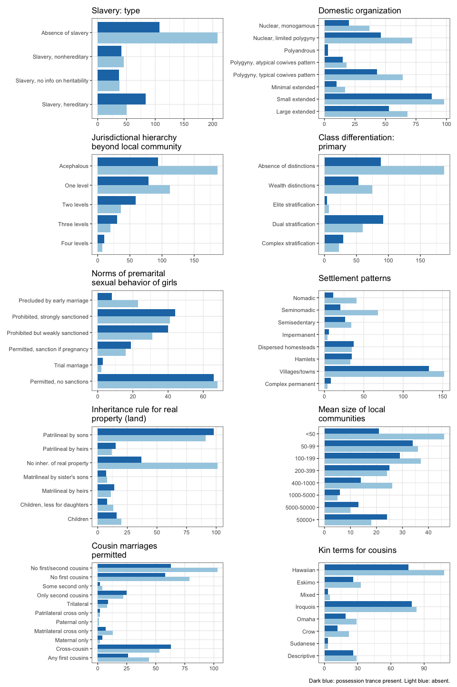

We want to look at two questions. What sort of social factors have been
proposed to co-occur with trance and possession phenomena? Using the
Ethnographic Atlas and the Standard Cross-Cultural Sample, can we get
more confident that these factors do co-occur with such phenomena across
cultures?

## 1. Trance and possession phenomena have societal covariates in the literature

Many people have argued that trance induced by possession is not a
random, idiosyncratic pathology but a recurrent psycho-social trait that
is at least partly motivated by other social factors.

High overall social complexity and social rigidity – the resulting power
dynamics – might translate to possession trance practices. Such
practices might serve to express or relay perceived social inflexibility
and inequality. This is echoed in the medical anthropology literature
(During et al. (2011),Dein, Cook, and Koenig (2012)) and ties in with
broader questions of inequality and mental health (Nguyen and Peschard
(2003)). Various causative models have been proposed to account for the
emergence of possession trance and, specifically, shamanism in a social
setting (M. Winkelman (2015), Singh (2018), C. Wood et al. (2018)).

Some or most groups can feel stuck in a society. If this makes trance
and possession more likely, we should see correlations between measures
of social complexity, organisation, and inequality and possession and
trance in cross-cultural data. Many such correlations have been proposed
by previous work. Here is a list, cross-referenced with C. P. Wood and
Stockly (2018):

| Relationship                                                 | Reference                     |
|:-----------------------------------|:-----------------------------------|
| Social complexity, rigidity, gender role differentiation     | Bourguignon (1968)            |
| Women’s social participation                                 | Bourguignon (1973)            |
| Slavery, role differentiation, and structure differentiation | Greenbaum (1973)              |
| Increased social participation                               | Swanson (1978)                |
| Social complexity                                            | M. J. Winkelman (1986)        |
| Social flexibility, cognatic kinship                         | Shaara (1992)                 |
| Decreased social participation                               | Douglas (2004)                |
| Social rigidity, monotheism                                  | C. P. Wood and Stockly (2018) |

Several works made the same point or emphasised various aspects of the
same relationship. The above table is somewhat reductive.

## 2. This can be mapped to the Ethnographic Atlas

The use of cross-cultural typological data in general and the
Ethnographic Atlas in particular has precedents. Bourguignon (1968),
Bourguignon (1973), and Greenbaum (1973) use the Ethnographic Atlas to
look for correlates of trance and possession trance. C. P. Wood and
Stockly (2018), Shaara (1992), M. J. Winkelman (1986), and Douglas
(2004) build on this research by specifying and compiling their own data
sets. The present paper uses the Ethnographic Atlas as made available in
the D-Place database, Kirby et al. (2016).

The Atlas records the presence of trance and possession phenomena in a
given society, using the following variable (EA112):

| Coding | Description                                                                                                                                                                                                                                    | possession_trance | n in EA | n in SCCS |
|-------:|:-----------------------------------------------------------------------------------------------------------------------------------------------------------------------------------------------------------------------------------------------|:------------------|--------:|----------:|
|      1 | Trance behavior is known to occur, but there is no belief in possession.                                                                                                                                                                       | other             |     135 |        26 |
|      2 | A belief in possession exists.                                                                                                                                                                                                                 | other             |      45 |         9 |
|      3 | Trance behavior is known to occur and is explained as due to possession. There is no possession belief referring to other experiences and there are no trance states with other explanations.                                                  | possession trance |      67 |        10 |
|      4 | Two types of trance states are known to occur. One which is explained as due to possession and one which is given another type of explanation. In addition to explaining trance, possession belief also refers to one or more other phenomena. | possession trance |      93 |        31 |
|      5 | There is both a trance state and a belief in possession, but this belief refers to phenomena other than trance, which is explained through other categories.                                                                                   | other             |      79 |        27 |
|      6 | Trance explained as due to possession is known to occur, and there are no other trance states, but cases of possession outside of trance are also believed to occur.                                                                           | possession trance |      85 |        25 |
|      7 | Trance states of two kinds are known to occur, some of which are explained by possession. No other phenomena are explained by possession.                                                                                                      | possession trance |      36 |         5 |
|      8 | No trance states of any kind are known to occur, and there is no belief in possession.                                                                                                                                                         | other             |     118 |        18 |

This is basically a truth table of whether possession beliefs or trance
states are present in a given society, with some causal links between
the two (if possession happens it leads to trance, if trance happens
it’s because of possession, etc). We can think of different groupings
(trance phenomena encompass levels 1,3,4,5,6,7, possession phenomena
encompass 2,3,4,5,6,7, specifically possession trance covers 3,4,6,7 but
not 1,2,5,8).

The Atlas lists a set of variables that tie in with the observed
covariates in the literature. These are either taken literally from
Bourguignon (1968), Bourguignon (1973), and Greenbaum (1973) or adapt
variables used by C. P. Wood and Stockly (2018), Shaara (1992), M. J.
Winkelman (1986), and Douglas (2004).

| ID    | Name                                            | Definition                                                                                                                                                                                                                                                                                                                                                                                                                                                                                                                                                                                                                                                                      |
|:------|:------------------------------------------------|:--------------------------------------------------------------------------------------------------------------------------------------------------------------------------------------------------------------------------------------------------------------------------------------------------------------------------------------------------------------------------------------------------------------------------------------------------------------------------------------------------------------------------------------------------------------------------------------------------------------------------------------------------------------------------------|
| EA008 | Domestic organization                           | The prevailing form of domestic or familial organization.                                                                                                                                                                                                                                                                                                                                                                                                                                                                                                                                                                                                                       |
| EA012 | Marital residence with kin: prevailing pattern  | The prevailing profile of marital residence in the society.                                                                                                                                                                                                                                                                                                                                                                                                                                                                                                                                                                                                                     |
| EA015 | Community marriage organization                 | The prevalence of local endogamy, agamy, and exogamy, together with the presence or absence of localized kin groups. The specific structure of clans, whether ambilocal, matrilocal, or patrilocal, is revealed by the variable describing prevailing patterns of residence with kin.                                                                                                                                                                                                                                                                                                                                                                                           |
| EA023 | Cousin marriages permitted                      | The rules or practices governing the marriageability or nonmarriageability of a man’s first cousins and, in some cases, second cousins.                                                                                                                                                                                                                                                                                                                                                                                                                                                                                                                                         |
| EA030 | Settlement patterns                             | The prevailing type of settlement pattern.                                                                                                                                                                                                                                                                                                                                                                                                                                                                                                                                                                                                                                      |
| EA031 | Mean size of local communities                  | The average population of local communities, whatever the pattern of settlement, computed from census data or other evidence.                                                                                                                                                                                                                                                                                                                                                                                                                                                                                                                                                   |
| EA032 | Jurisdictional hierarchy of local community     | The number of jurisdictional levels in the local community, with 2 representing the theoretical minimum (e.g., independent nuclear or polygynous families) and 4 representing the theoretical maximum (e.g., nuclear families nested within extended families and clan-barrios). See the variable ““Jurisdictional hierarchy beyond the local community”” for information on organization beyond the local community. Note that different types of organization on the same level, e.g., a consanguineal lineage and its localized equivalent, are counted as one, and organizations not held to be legitimate, e.g., imposed colonial regimes, are excluded.                   |
| EA033 | Jurisdictional hierarchy beyond local community | The number of jurisdictional levels beyond the local community, with 1 representing the theoretical minimum (e.g., none/autonomous bands or villages) and 4 representing the theoretical maximum (e.g., villages nested within parishes, districts, provinces, and a complex state). This variable also provides a measure of political complexity, ranging from 1 for stateless societies, through 2 or 3 for petty and larger paramount chiefdoms or their equivalent, to 4 or 5 for large states. Note that different types of organization on the same level are counted as one, and organizations not held to be legitimate, e.g., imposed colonial regimes, are excluded. |
| EA034 | Religion: high gods                             | The range of beliefs in high gods. A high god is defined, following Swanson, as a spiritual being who is believed to have created all reality and/or to be its ultimate governor, even if his sole act was to create other spirits who, in turn, created or control the natural world.                                                                                                                                                                                                                                                                                                                                                                                          |
| EA042 | Subsistence economy: dominant activity          | Dominant mode of subsistence (note: not in original EA; derived from other variables on subsistence and type of agriculture).                                                                                                                                                                                                                                                                                                                                                                                                                                                                                                                                                   |
| EA043 | Descent: major type                             | Major mode of descent (note: not in original EA; derived from variables describing patrilineal and matrilineal kin groups EA017, EA019 and EA021).                                                                                                                                                                                                                                                                                                                                                                                                                                                                                                                              |
| EA053 | Sex differences: animal husbandry               | Specialization by sex in animal husbandry.                                                                                                                                                                                                                                                                                                                                                                                                                                                                                                                                                                                                                                      |
| EA054 | Sex differences: agriculture                    | Specialization by sex in agriculture.                                                                                                                                                                                                                                                                                                                                                                                                                                                                                                                                                                                                                                           |
| EA066 | Class differentiation: primary                  | The degree and type of class differentiation, excluding purely political and religious statuses. See also ““Class differentiation: secondary,”” as some societies exhibit important features of two different types of class differentation.                                                                                                                                                                                                                                                                                                                                                                                                                                    |
| EA068 | Caste differentiation: primary                  | The degree and type of caste differentiation. See also ““Caste differentiation: secondary,”” as some societies exhibit important features of two different types of caste differentation.                                                                                                                                                                                                                                                                                                                                                                                                                                                                                       |
| EA070 | Slavery: type                                   | The forms and prevalence of slave status, treated quite independently of both class and caste status.                                                                                                                                                                                                                                                                                                                                                                                                                                                                                                                                                                           |
| EA072 | Political succession                            | Rules of succession applying to the office of local headman (or a close equivalent), without reference to rules of succession prevailing on higher levels of political integration.                                                                                                                                                                                                                                                                                                                                                                                                                                                                                             |
| EA073 | Political succession: hereditary succession     | Rules of succession applying to the office of local headman (or a close equivalent), without reference to rules of succession prevailing on higher levels of political integration.                                                                                                                                                                                                                                                                                                                                                                                                                                                                                             |
| EA074 | Inheritance rule for real property (land)       | The rule or practice governing the disposition or transmission of a man’s property in land (exclusive of any dower right of his widow). \[Note that Murdock (1963a) warned that the codes for this variable had ““proved inadequate and in serious need of revision,”” and that the coded data ““should consequently be used only with circumspection””\].                                                                                                                                                                                                                                                                                                                      |
| EA078 | Norms of premarital sexual behavior of girls    | Prevailing standards of sex behavior for unmarried women.                                                                                                                                                                                                                                                                                                                                                                                                                                                                                                                                                                                                                       |
| EA113 | Societal rigidity                               | Degree of rigidity in social structures. Considers stratification of society, whether status distinctions are earned or ascribed, degree of hierarchy of political system, extent to which residence and group membership are fixed, centralization of authority, flexibility of religious rites.                                                                                                                                                                                                                                                                                                                                                                               |

## 3. How do we look for correlations between trance and possession and their proposed societal covariates?

There are eight types of trance and possession phenomena recorded in the
Atlas and a wide set of possible covariates, all with a number of levels
(see the Appendix).

The data are challenging in two ways. The variables are themselves
correlated, either because they measure different facets of the same
thing (like how complex a society is; see the figure below) or because
they were adapted together by socially or geographically close societies
(Galton’s problem). In addition, data are missing from the Atlas in a
non-random manner (e.g. if a society is hard to access, it is harder to
provide a population size estimate for it).

We can account for Galton’s problem (geographic and cultural
co-variation) by restricting our initial data to societies in the
Standard Cross-Cultural Sample.

The remaining co-variation and the non-random patterns of missing data
recommends an ensemble learning method. This starts with societies with
information on trance and possession phenomena and builds a lot of tiny
models, using random samples of the data and random subsets of the
covariates. Then, we compare these models to assess the overall
importance of our covariates. Building little models in parallel is
called bagging. This is how a random forest works, growing many
classification or regression trees and aggregating over the results. One
step further is to train models on the mistakes of the previous models.
This is called [boosting](https://www.ibm.com/cloud/learn/boosting) and
usually results in higher training and prediction accuracy.

## 4. Building a boosting model

In this analysis, we will use a gradient boosting model on the data from
the Ethnographic Atlas, subsetting it to only include societies in the
Standard Cross-Cultural Sample.

Gradient boosting is an ensemble learning method which uses decision
trees. A decision tree is a directed tree graph in which each node
represents a decision or split based on a predictor variable and each
leaf is an individual data point. It can be used to classify leaves by
grouping them under different node structures. A gradient boosting
algorithm fits such trees in a sequence, training each on the errors of
the previous one, minimising overall error. It stops when further
iterations do not result in meaningful improvement on model accuracy
(according to pre-set criteria) Smith (2017).

We only fit the model on societies which (a) have information on whether
trance and possession phenomena are present and (b) come from the
standard cross-cultural sample.

Following Bourguignon (1968), we reduce the complexity of the outcome
variable to two levels: whether a society has possession trance or not.
The predictors are the possible covariates identified above. Some
predictors, like `EA032` (Jurisdictional hierarchy of local community)
or `EA113` can be construed to follow a scale. These are input as
ordered factors. Others, like `EA053` (Sex differences in animal
husbandry) or `EA043` (Major type of descent) can be carved up into
categories: These are one-hot encoded. For details, see the Appendix.

We use hyperparameter tuning to find the best possible model. The model
is fit on a training set of `length(unique(sccs$soc_id))` societies with
information on trance and possession in the standard cross-cultural
sample.

## 5. Results on the training sample

Looking back at the table in the previous section, we see that only
about 10% of societies have no trance or possession phenomena. From the
rest, a majority have possession trance in some form. Following
Bourguignon (1968) we can reduce this to a binary: 81 societies have
possession trance, 70 have other forms of trance and possessior or show
neither.

| possession_trance | count |
|:------------------|------:|
| possession trance |    71 |
| other             |    80 |

We compare this with how our best model categorises each society. This
is our model’s confusion matrix. `0` is absence of possession trance,
`1` is presence of possession trance. The rows add up to values in the
original, the columns are the model’s predictions. The last two columns
show the error rate.

| original |   0 |   1 | Error | Rate    |
|:---------|----:|----:|------:|:--------|
| 0        |  68 |  12 |  0.15 | =12/80  |
| 1        |   7 |  64 |  0.10 | =7/71   |
| Total    |  75 |  76 |  0.13 | =19/151 |

    ## 
    ##  Chi-squared test for given probabilities
    ## 
    ## data:  c(c(68, 12), c(7, 64))
    ## X-squared = 85.106, df = 3, p-value < 2.2e-16

The model has an F-measure of 0.87, with a penalty on slightly
overgeneralising possession trance. Though comparisons are hard to make,
this is not particularly accurate for a binary categorisation problem.
We did expect this, though, as it is unlikely that any complex cultural
phenomenon could be reduced to a small number of cross-cultural
predictors.

### 6. Results on the EA data

We can ask the model to make predictions for the entire Ethnographic
Atlas (where trance and possession data are available) – including the
SCCS subset. Generally, you want to separate the training and test sets
in Machine Learning and not do this, but the ‘everything except the
SCCS’ subset of the Atlas would be an odd test set.

Here is the confusion matrix for all 658 societies in the Atlas where
trance and possession information are available:

| possession_trance_present |   0 |   1 |
|--------------------------:|----:|----:|
|                         0 | 264 | 113 |
|                         1 |  87 | 194 |

    ## 
    ##  Chi-squared test for given probabilities
    ## 
    ## data:  c(c(264, 113), c(87, 194))
    ## X-squared = 118.11, df = 3, p-value < 2.2e-16

The F-measue of this model is 0.66. Accuracy here is much worse than for
the training data only. That is at least partly because the model is
ignorant of the phylogenetic signal which might result in patterns that
are unexpected from a purely correlational point of view. However, the
model is still more accurate than it would be by chance.

We take a look at the variables that were most important in the model in
predicting the presence of possession trance in a given society, with a
cutoff of 10/47.

| ID    | Name                                            | relative_importance |
|:------|:------------------------------------------------|--------------------:|
| EA070 | Slavery: type                                   |               75.60 |
| EA008 | Domestic organization                           |               60.69 |
| EA078 | Norms of premarital sexual behavior of girls    |               48.41 |
| EA066 | Class differentiation: primary                  |               47.78 |
| EA033 | Jurisdictional hierarchy beyond local community |               38.08 |
| EA030 | Settlement patterns                             |               33.61 |
| EA034 | Religion: high gods                             |               23.14 |
| EA023 | Cousin marriages permitted                      |               21.12 |
| EA074 | Inheritance rule for real property (land)       |               19.86 |
| EA031 | Mean size of local communities                  |               17.13 |

We now look at the direction of these effects (does e.g. increased
jurisdictional hierarchy go with more or less prevalent possession
trance?).

The figure below shows the proportion of societies with possession
trance (dark blue) and without (light blue) across the ordered levels of
the predictors that the model thinks are important. They come in order
of how important they are, according to the model; prevalence of
slavery, then family organisation, and so on. The predictor levels are
ordered according to coding and generally go from a pattern being less
prevalent (top) to more prevalent (bottom):

Ee see a clear correlation between the presence of possession trance and
the variable scaling up, e.g. societies in which slavery is more
prevalent have more possession trance than those where it is less
prevalent. The across-level distributions are also interesting, e.g. the
main distinction for patterns of slavery is for societies without
slavery (first factor level) and all others with some form of slavery
(subsequent factor levels).

## 7. Summary

These results go some way in confirming hypotheses on the cross-cultural
correlates of possession trance in the literature. Bourguignon (1968)
explicitly tests the variables of slavery, jurisdictional hierarchy,
settlement patterns, and kin groups. Shaara (1992) point to a high value
placed on female virginity at marriage, captured here by norms of
premarital sexual behaviour for girls, C. P. Wood and Stockly (2018)
point to the role of moralising high gods. These are all important
variables in our model. Greenbaum (1973) and Shaara (1992) point to
sexual division of labour but this is not relevant in our model.

Note that Shaara (1992) use cognatic kinship as a proxy of social
complexity (which in itself is robustly supported by our model) while
the measure referenced by C. P. Wood and Stockly (2018), the presence of
moralising high gods, has in itself been argued to correlate with social
complexity (see Botero et al. (2014) and Watts et al. (2015)).

This brings us back to the original predictions in the table above.

| Relationship                                                               | Reference                     | Our model                                          |
|:-----------------------|:-----------------------|:-----------------------|
| less complexity → trance w/o possession                                    | Bourguignon (1968)            | the same measures of complexity are relevant       |
| women’s social participation                                               | Bourguignon (1973)            | labour divisions are not relevant                  |
| increased role differentiation and slavery practices→trance and possession | Greenbaum (1973)              | slavery, social and class complexity are relevant  |
| main mode of subsistence                                                   | Bourguignon and Evascu (1977) | not relevant                                       |
| increased social participation → possession                                | Swanson (1978)                | indirectly, through domestic and social complexity |
| more complexity → trance w/ possession                                     | M. J. Winkelman (1986)        | yes, see above                                     |
| cognatic kinship → more possession and trance                              | Shaara (1992)                 | not directly                                       |
| decreased social participation → possession                                | Douglas (2004)                | yes, see above                                     |
| monotheism                                                                 | C. P. Wood and Stockly (2018) | yes                                                |

We can predict some types of trance and possession phenomena in the SCCS
subset of the EA. Not all of them. Some of the important co-variates are
the ones mentioned by earlier work and the direction of the
relationships corroborates the literature.

Human society is complicated and cross-cultural data have very low
resolution. In this sense, we’d be very suspect of a model that would be
too accurate of predicting possession trance from societal covariates.
It cannot replace fieldwork and more complex explanatory models either.
What it can do is provide an extra leg for such explanatory work, which
is broadly the recognised ambition of cross-cultural comparative work in
evolutionary anthropology.

Our approach is statistically strict, so the fact that it still shows
some accuracy is definitely promising for the validity of the
connections drawn by previous work on trance and possession phenomena in
particular and large cross-cultural comparisons in general.

## Appendix

### Relevant predictors in the Ethnographic Atlas

A survey of the literature resulted in the following predictors of
trance and possession phenomena.

| var_definition                                                                                                                                                                                                                                                                                                                                                                                                                                                                                                                                                                                                                                                                  | ID    | Name                                            | levels                                                                                                                                                                                                                      |
|:--------------------------------------------------------------------------------------------------------------------------------------------------------------------------------------------------------------------------------------------------------------------------------------------------------------------------------------------------------------------------------------------------------------------------------------------------------------------------------------------------------------------------------------------------------------------------------------------------------------------------------------------------------------------------------|:------|:------------------------------------------------|:----------------------------------------------------------------------------------------------------------------------------------------------------------------------------------------------------------------------------|
| The prevailing form of domestic or familial organization.                                                                                                                                                                                                                                                                                                                                                                                                                                                                                                                                                                                                                       | EA008 | Domestic organization                           | Small extended, Nuclear, monogamous, Nuclear, limited polygyny, Polygyny, atypical cowives pattern, Polygyny, typical cowives pattern, Large extended, Minimal extended, Missing data, Polyandrous                          |
| The prevailing profile of marital residence in the society.                                                                                                                                                                                                                                                                                                                                                                                                                                                                                                                                                                                                                     | EA012 | Marital residence with kin: prevailing pattern  | Ambilocal, Patrilocal, Ambi-viri, Virilocal, Avunculocal, Avuncu-virilocal, Avuncu-uxorilocal, Matrilocal, Neolocal, Separate, Ambi-uxo, Uxorilocal, Missing data                                                           |
| The prevalence of local endogamy, agamy, and exogamy, together with the presence or absence of localized kin groups. The specific structure of clans, whether ambilocal, matrilocal, or patrilocal, is revealed by the variable describing prevailing patterns of residence with kin.                                                                                                                                                                                                                                                                                                                                                                                           | EA015 | Community marriage organization                 | Exogamous, Clans, Agamous, Segmented, no exogamy, Missing data, Segmented, exogamy, Demes                                                                                                                                   |
| The rules or practices governing the marriageability or nonmarriageability of a man’s first cousins and, in some cases, second cousins.                                                                                                                                                                                                                                                                                                                                                                                                                                                                                                                                         | EA023 | Cousin marriages permitted                      | No first/second cousins, No first cousins, Cross-cousin, Any first cousins, Only second cousins, Matrilateral cross only, Patrilateral cross only, Trilateral, Missing data, Maternal only, Some second only, Paternal only |
| The prevailing type of settlement pattern.                                                                                                                                                                                                                                                                                                                                                                                                                                                                                                                                                                                                                                      | EA030 | Settlement patterns                             | Nomadic, Missing data, Dispersed homesteads, Complex permanent, Hamlets, Semisedentary, Villages/towns, Impermanent, Seminomadic                                                                                            |
| The average population of local communities, whatever the pattern of settlement, computed from census data or other evidence.                                                                                                                                                                                                                                                                                                                                                                                                                                                                                                                                                   | EA031 | Mean size of local communities                  | \<50, 100-199, Missing data, 5000-50000, 400-1000, 50-99, 200-399, 50000+, 1000-5000                                                                                                                                        |
| The number of jurisdictional levels in the local community, with 2 representing the theoretical minimum (e.g., independent nuclear or polygynous families) and 4 representing the theoretical maximum (e.g., nuclear families nested within extended families and clan-barrios). See the variable ““Jurisdictional hierarchy beyond the local community”” for information on organization beyond the local community. Note that different types of organization on the same level, e.g., a consanguineal lineage and its localized equivalent, are counted as one, and organizations not held to be legitimate, e.g., imposed colonial regimes, are excluded.                   | EA032 | Jurisdictional hierarchy of local community     | Extended families, Independent families, Missing data, Clan-barrios                                                                                                                                                         |
| The number of jurisdictional levels beyond the local community, with 1 representing the theoretical minimum (e.g., none/autonomous bands or villages) and 4 representing the theoretical maximum (e.g., villages nested within parishes, districts, provinces, and a complex state). This variable also provides a measure of political complexity, ranging from 1 for stateless societies, through 2 or 3 for petty and larger paramount chiefdoms or their equivalent, to 4 or 5 for large states. Note that different types of organization on the same level are counted as one, and organizations not held to be legitimate, e.g., imposed colonial regimes, are excluded. | EA033 | Jurisdictional hierarchy beyond local community | Acephalous, One level, Missing data, Two levels, Three levels, Four levels                                                                                                                                                  |
| The range of beliefs in high gods. A high god is defined, following Swanson, as a spiritual being who is believed to have created all reality and/or to be its ultimate governor, even if his sole act was to create other spirits who, in turn, created or control the natural world.                                                                                                                                                                                                                                                                                                                                                                                          | EA034 | Religion: high gods                             | Active, but not supporting morality, Absent, Missing data, Otiose, Active, supporting morality                                                                                                                              |
| Dominant mode of subsistence (note: not in original EA; derived from other variables on subsistence and type of agriculture).                                                                                                                                                                                                                                                                                                                                                                                                                                                                                                                                                   | EA042 | Subsistence economy: dominant activity          | Gathering, Hunting, Pastoralism, Extensive agriculture, Two or more sources, Intensive agriculture, Agriculture, type unknown, Fishing                                                                                      |
| Major mode of descent (note: not in original EA; derived from variables describing patrilineal and matrilineal kin groups EA017, EA019 and EA021).                                                                                                                                                                                                                                                                                                                                                                                                                                                                                                                              | EA043 | Descent: major type                             | Bilateral, Patrilineal, Duolateral, Quasi-lineages, Mixed, Matrilineal, Ambilineal, Missing data                                                                                                                            |
| Specialization by sex in animal husbandry.                                                                                                                                                                                                                                                                                                                                                                                                                                                                                                                                                                                                                                      | EA053 | Sex differences: animal husbandry               | Activity is absent, Differentiated but equal, Missing data, Males alone, Equal participation, Both, males more, Females alone, Both, females more                                                                           |
| Specialization by sex in agriculture.                                                                                                                                                                                                                                                                                                                                                                                                                                                                                                                                                                                                                                           | EA054 | Sex differences: agriculture                    | Activity is absent, Missing data, Both, females more, Differentiated but equal, Equal participation, Females alone, Both, males more, Males alone                                                                           |
| The degree and type of class differentiation, excluding purely political and religious statuses. See also ““Class differentiation: secondary,”” as some societies exhibit important features of two different types of class differentation.                                                                                                                                                                                                                                                                                                                                                                                                                                    | EA066 | Class differentiation: primary                  | Absence of distinctions, Wealth distinctions, Dual stratification, Elite stratification, Missing data, Complex stratification                                                                                               |
| The degree and type of caste differentiation. See also ““Caste differentiation: secondary,”” as some societies exhibit important features of two different types of caste differentation.                                                                                                                                                                                                                                                                                                                                                                                                                                                                                       | EA068 | Caste differentiation: primary                  | Absence of distinctions, Ethnic stratification, Missing data, Despised occupation groups, Complex caste stratification                                                                                                      |
| The forms and prevalence of slave status, treated quite independently of both class and caste status.                                                                                                                                                                                                                                                                                                                                                                                                                                                                                                                                                                           | EA070 | Slavery: type                                   | Absence of slavery, Slavery, nonhereditary, Slavery, hereditary, Slavery, no info on heritability, Missing data                                                                                                             |
| Rules of succession applying to the office of local headman (or a close equivalent), without reference to rules of succession prevailing on higher levels of political integration.                                                                                                                                                                                                                                                                                                                                                                                                                                                                                             | EA072 | Political succession                            | Patrilineal heir, Nonhered: inf. consensus, Absence of office, Missing data, Nonhered: appointed by auth., Matrilineal heir, Nonhered: seniority, Nonhered: election, Nonhered: influence                                   |
| Rules of succession applying to the office of local headman (or a close equivalent), without reference to rules of succession prevailing on higher levels of political integration.                                                                                                                                                                                                                                                                                                                                                                                                                                                                                             | EA073 | Political succession: hereditary succession     | Son, Nonhereditary, Absence of office, Missing data, Patrilineal heir, Sister’s son, Matrilineal heir                                                                                                                       |
| The rule or practice governing the disposition or transmission of a man’s property in land (exclusive of any dower right of his widow). \[Note that Murdock (1963a) warned that the codes for this variable had ““proved inadequate and in serious need of revision,”” and that the coded data ““should consequently be used only with circumspection””\].                                                                                                                                                                                                                                                                                                                      | EA074 | Inheritance rule for real property (land)       | No inher. of real property, Patrilineal by sons, Missing data, Matrilineal by sister’s sons, Matrilineal by heirs, Patrilineal by heirs, Children, less for daughters, Children                                             |
| Prevailing standards of sex behavior for unmarried women.                                                                                                                                                                                                                                                                                                                                                                                                                                                                                                                                                                                                                       | EA078 | Norms of premarital sexual behavior of girls    | Precluded by early marriage, Missing data, Permitted, sanction if pregnancy, Permitted, no sanctions, Prohibited but weakly sanctioned, Prohibited, strongly sanctioned, Trial marriage                                     |
| Degree of rigidity in social structures. Considers stratification of society, whether status distinctions are earned or ascribed, degree of hierarchy of political system, extent to which residence and group membership are fixed, centralization of authority, flexibility of religious rites.                                                                                                                                                                                                                                                                                                                                                                               | EA113 | Societal rigidity                               | Flexible, Missing data, Rigid                                                                                                                                                                                               |

### Recoded values in the Ethnographic Atlas

The recoded values were used in the model for each predictor. Where the
recoded values are numeric, the predictor was used as an ordered factor.
Where the recoded values are strings, the predictor was one-hot encoded
(such that predictor A with levels 1, 2, and 3 was turned into boolean
predictors A==2 and A==3).

| var_id | var_title                                       | var_description                                                                                                                                                                                                                                                                                                                                                                | recoded_value |
|:-------|:------------------------------------------------|:-------------------------------------------------------------------------------------------------------------------------------------------------------------------------------------------------------------------------------------------------------------------------------------------------------------------------------------------------------------------------------|:--------------|
| EA008  | Domestic organization                           | Independent nuclear families with monogamy                                                                                                                                                                                                                                                                                                                                     | 1             |
| EA008  | Domestic organization                           | Independent nuclear families with occasional or limited polygyny                                                                                                                                                                                                                                                                                                               | 2             |
| EA008  | Domestic organization                           | Independent polyandrous families                                                                                                                                                                                                                                                                                                                                               | 3             |
| EA008  | Domestic organization                           | Independent polygynous families, unusual co-wives pattern (either polygyny is preferentially sororal, with cowives in separate quarters or it is typically non-sororal, with cowives in same quarters                                                                                                                                                                          | 4             |
| EA008  | Domestic organization                           | Independent polygynous families, usual co-wives pattern (either polygyny is preferentially sororal, with cowives in same quarters, OR typically non-sororal, with cowives in separate quarters)                                                                                                                                                                                | 5             |
| EA008  | Domestic organization                           | Minimal extended or ““stem”” families, i.e., those consisting of only two related families of procreation (disregarding polygamous unions), particularly of adjacent generations                                                                                                                                                                                               | 6             |
| EA008  | Domestic organization                           | Small extended families, i.e., those normally embracing the families of procreation of only one individual in the senior generation but of at least two in the next generation. Such families usually dissolve on the death of the head                                                                                                                                        | 7             |
| EA008  | Domestic organization                           | Large extended families, i.e., corporate aggregations of smaller family units occupying a single dwelling or a number of adjacent dwellings and normally embracing the families of procreation of at least two siblings or cousins in each of at least two adjacent generations                                                                                                | 8             |
| EA008  | Domestic organization                           | Missing data                                                                                                                                                                                                                                                                                                                                                                   | NA            |
| EA012  | Marital residence with kin: prevailing pattern  | Patrilocal, i.e., normal residence with or near the male patrilineal kinsmen of the husband. Cf. V Virilocal                                                                                                                                                                                                                                                                   | husband       |
| EA012  | Marital residence with kin: prevailing pattern  | Ambilocal, with a marked preponderance of virilocal practice (i.e., virilocal option exceeds uxorilocal option in actual frequency by a ratio greater than two to one).                                                                                                                                                                                                        | husband       |
| EA012  | Marital residence with kin: prevailing pattern  | Virilocal. Equivalent to ““patrilocal”” but confined to instances where the husband’s patrikin are not aggregated in patrilocal and patrilineal kin groups                                                                                                                                                                                                                     | husband       |
| EA012  | Marital residence with kin: prevailing pattern  | Optionally patrilocal (or virilocal) or avunculocal                                                                                                                                                                                                                                                                                                                            | husband       |
| EA012  | Marital residence with kin: prevailing pattern  | Ambilocal, i.e., residence established optionally with or near the parents of either the husband or the wife, depending upon circumstances or personal choice, where neither alternative exceeds the other in actual frequency by a ratio greater than two to one.                                                                                                             | other         |
| EA012  | Marital residence with kin: prevailing pattern  | Neolocal, i.e., normal residence apart from the relatives of both spouses or at a place not determined by the kin ties of either                                                                                                                                                                                                                                               | other         |
| EA012  | Marital residence with kin: prevailing pattern  | Nonestablishment of a common household, i.e., where both spouses remain in their natal households, sometimes called ““duolocal”” or ““natolocal”” residence                                                                                                                                                                                                                    | other         |
| EA012  | Marital residence with kin: prevailing pattern  | Avunculocal, i.e., normal residence with or near the maternal uncle or other male matrilineal kinsmen of the husband                                                                                                                                                                                                                                                           | wife          |
| EA012  | Marital residence with kin: prevailing pattern  | Optionally uxorilocal or avunculocal. This may be the case in a uxorilocal society where many men marry a MoBrDa and thus, in fact, live avunculocally                                                                                                                                                                                                                         | wife          |
| EA012  | Marital residence with kin: prevailing pattern  | Matrilocal, i.e., normal residence with or near the female matrilineal kinsmen of the wife. Cf. U Uxorilocal                                                                                                                                                                                                                                                                   | wife          |
| EA012  | Marital residence with kin: prevailing pattern  | Ambilocal, with a marked preponderance of uxorilocal practice (i.e., uxorilocal option exceeds virilocal option in actual frequency by a ratio greater than two to one).                                                                                                                                                                                                       | wife          |
| EA012  | Marital residence with kin: prevailing pattern  | Uxorilocal. Equivalent to ““matrilocal”” but confined to instances where the wife’s matrikin are not aggregated in matrilocal and matrilineal kin groups                                                                                                                                                                                                                       | wife          |
| EA012  | Marital residence with kin: prevailing pattern  | Missing data                                                                                                                                                                                                                                                                                                                                                                   | NA            |
| EA015  | Community marriage organization                 | Agamous communities without localized clans or any marked tendency toward either local exogamy or local endogamy                                                                                                                                                                                                                                                               | agamous       |
| EA015  | Community marriage organization                 | Segmented communities, i.e., those divided into barrios, wards, or hamlets, each of which is essentially a localized kin group, a clan or ramage, in the absence of any indication of local exogamy. Large extended families (see ““Domestic organization”“), are treated as clan-barrios if they are integrated by a rule of ambilineal, matrilineal, or patrilineal descent. | endogamous    |
| EA015  | Community marriage organization                 | Demes, i.e., communities revealing a marked tendency toward local endogamy but not segmented into clan-barrios                                                                                                                                                                                                                                                                 | endogamous    |
| EA015  | Community marriage organization                 | Exogamous communities, i.e., those revealing a marked tendency toward local exogamy without having the specific structure of clans                                                                                                                                                                                                                                             | exogamous     |
| EA015  | Community marriage organization                 | Clan-communities, each consisting essentially of a single localized exogamous kin group or clan (see ““Organization of clan communities”” for more detail)                                                                                                                                                                                                                     | exogamous     |
| EA015  | Community marriage organization                 | Segmented communities where a marked tendency toward local exogamy is also specifically reported                                                                                                                                                                                                                                                                               | exogamous     |
| EA015  | Community marriage organization                 | Missing data                                                                                                                                                                                                                                                                                                                                                                   | NA            |
| EA023  | Cousin marriages permitted                      | Nonlateral marriage, i.e., unions forbidden with any first or second cousin                                                                                                                                                                                                                                                                                                    | 1             |
| EA023  | Cousin marriages permitted                      | Nonlateral marriage, evidence available only for first cousins                                                                                                                                                                                                                                                                                                                 | 1             |
| EA023  | Cousin marriages permitted                      | Nonlateral marriage in which unions are forbidden with any first cousin but are permitted with any second cousin (or at least any who is not a lineage mate)                                                                                                                                                                                                                   | 2             |
| EA023  | Cousin marriages permitted                      | Nonlateral marriage in which all first cousins and some but not all second cousins are forbidden as spouses                                                                                                                                                                                                                                                                    | 2             |
| EA023  | Cousin marriages permitted                      | Duolateral cross-cousin marriage permitted, i.e., marriage allowed with either MoBrDa or FaSiDa but forbidden with a parallel cousin                                                                                                                                                                                                                                           | 3             |
| EA023  | Cousin marriages permitted                      | Unilateral: only matrilateral cross-cousin marriage permitted, i.e., with a MoBrDa                                                                                                                                                                                                                                                                                             | 3             |
| EA023  | Cousin marriages permitted                      | Unilateral: only patrilateral cross-cousin marriage permitted i.e., with a FaSiDa                                                                                                                                                                                                                                                                                              | 3             |
| EA023  | Cousin marriages permitted                      | Trilateral marriage, i.e., marriage allowed with any first cousin except an orthocousin or lineage mate                                                                                                                                                                                                                                                                        | 3             |
| EA023  | Cousin marriages permitted                      | Duolateral marriage permitted with maternal cousins only (MoBrDa or MoSiDa)                                                                                                                                                                                                                                                                                                    | 3             |
| EA023  | Cousin marriages permitted                      | Duolateral marriage permitted with paternal cousins only (FaBrDa or FaSiDa)                                                                                                                                                                                                                                                                                                    | 3             |
| EA023  | Cousin marriages permitted                      | Quadrilateral marriage, i.e., marriage allowed with any first cousin                                                                                                                                                                                                                                                                                                           | 4             |
| EA023  | Cousin marriages permitted                      | Missing data                                                                                                                                                                                                                                                                                                                                                                   | NA            |
| EA030  | Settlement patterns                             | Fully migratory or nomadic bands                                                                                                                                                                                                                                                                                                                                               | 1             |
| EA030  | Settlement patterns                             | Seminomadic communities whose members wander in bands for at least half of the year but occupy a fixed settlement at some season or seasons, e.g., recurrently occupied winter quarters                                                                                                                                                                                        | 2             |
| EA030  | Settlement patterns                             | Semisedentary communities whose members shift from one to another fixed settlement at different seasons or who occupy more or less permanently a single settlement from which a substantial proportion of the population departs seasonally to occupy shifting camps, e.g., during transhumance                                                                                | 3             |
| EA030  | Settlement patterns                             | Compact but impermanent settlements, i.e., villages whose location is shifted every few years                                                                                                                                                                                                                                                                                  | 4             |
| EA030  | Settlement patterns                             | Neighborhoods of dispersed family homesteads                                                                                                                                                                                                                                                                                                                                   | 5             |
| EA030  | Settlement patterns                             | Separated hamlets where several such form a more or less permanent single community                                                                                                                                                                                                                                                                                            | 6             |
| EA030  | Settlement patterns                             | Compact and relatively permanent settlements, i.e., nucleated villages or towns                                                                                                                                                                                                                                                                                                | 7             |
| EA030  | Settlement patterns                             | Complex settlements consisting of a nucleated village or town with outlying homesteads or satellite hamlets. Urban aggregations of population are not separately indicated since EA031 deals with community size                                                                                                                                                               | 8             |
| EA030  | Settlement patterns                             | Missing data                                                                                                                                                                                                                                                                                                                                                                   | NA            |
| EA031  | Mean size of local communities                  | Fewer than 50 persons                                                                                                                                                                                                                                                                                                                                                          | 1             |
| EA031  | Mean size of local communities                  | From 50 to 99 persons                                                                                                                                                                                                                                                                                                                                                          | 2             |
| EA031  | Mean size of local communities                  | From 100 to 199 persons                                                                                                                                                                                                                                                                                                                                                        | 3             |
| EA031  | Mean size of local communities                  | From 200 to 399 persons                                                                                                                                                                                                                                                                                                                                                        | 4             |
| EA031  | Mean size of local communities                  | From 400 to 1,000 persons                                                                                                                                                                                                                                                                                                                                                      | 5             |
| EA031  | Mean size of local communities                  | More than 1,000 persons in the absence of indigenous urban aggregations of more than 5,000                                                                                                                                                                                                                                                                                     | 6             |
| EA031  | Mean size of local communities                  | One or more indigenous towns of more than 5,000 inhabitants but none of more than 50,000                                                                                                                                                                                                                                                                                       | 7             |
| EA031  | Mean size of local communities                  | One or more indigenous cities with more than 50,000 inhabitants                                                                                                                                                                                                                                                                                                                | 8             |
| EA031  | Mean size of local communities                  | Missing data                                                                                                                                                                                                                                                                                                                                                                   | NA            |
| EA032  | Jurisdictional hierarchy of local community     | Independent families (may be nuclear or polygynous)                                                                                                                                                                                                                                                                                                                            | 2             |
| EA032  | Jurisdictional hierarchy of local community     | Extended families                                                                                                                                                                                                                                                                                                                                                              | 3             |
| EA032  | Jurisdictional hierarchy of local community     | Clan-barrios                                                                                                                                                                                                                                                                                                                                                                   | 4             |
| EA032  | Jurisdictional hierarchy of local community     | Missing data                                                                                                                                                                                                                                                                                                                                                                   | NA            |
| EA033  | Jurisdictional hierarchy beyond local community | No political authority beyond community (e.g., autonomous bands and villages)                                                                                                                                                                                                                                                                                                  | 1             |
| EA033  | Jurisdictional hierarchy beyond local community | One level (e.g., petty chiefdoms)                                                                                                                                                                                                                                                                                                                                              | 2             |
| EA033  | Jurisdictional hierarchy beyond local community | Two levels (e.g., larger chiefdoms)                                                                                                                                                                                                                                                                                                                                            | 3             |
| EA033  | Jurisdictional hierarchy beyond local community | Three levels (e.g., states)                                                                                                                                                                                                                                                                                                                                                    | 4             |
| EA033  | Jurisdictional hierarchy beyond local community | Four levels (e.g., large states)                                                                                                                                                                                                                                                                                                                                               | 5             |
| EA033  | Jurisdictional hierarchy beyond local community | Missing data                                                                                                                                                                                                                                                                                                                                                                   | NA            |
| EA034  | Religion: high gods                             | A high god absent or not reported in substantial descriptions of religious beliefs                                                                                                                                                                                                                                                                                             | 1             |
| EA034  | Religion: high gods                             | A high god present but otiose or not concerned with human affairs                                                                                                                                                                                                                                                                                                              | 2             |
| EA034  | Religion: high gods                             | A high god present and active in human affairs but not offering positive support to human morality                                                                                                                                                                                                                                                                             | 3             |
| EA034  | Religion: high gods                             | A high god present, active, and specifically supportive of human morality                                                                                                                                                                                                                                                                                                      | 4             |
| EA034  | Religion: high gods                             | Missing data                                                                                                                                                                                                                                                                                                                                                                   | NA            |
| EA042  | Subsistence economy: dominant activity          | Extensive agriculture contributes most                                                                                                                                                                                                                                                                                                                                         | ext_agr       |
| EA042  | Subsistence economy: dominant activity          | Agriculture contributes most, type unknown                                                                                                                                                                                                                                                                                                                                     | ext_agr       |
| EA042  | Subsistence economy: dominant activity          | Gathering contributes most                                                                                                                                                                                                                                                                                                                                                     | foraging      |
| EA042  | Subsistence economy: dominant activity          | Hunting contributes most                                                                                                                                                                                                                                                                                                                                                       | foraging      |
| EA042  | Subsistence economy: dominant activity          | Fishing contributes most                                                                                                                                                                                                                                                                                                                                                       | foraging      |
| EA042  | Subsistence economy: dominant activity          | Intensive agriculture contributes most                                                                                                                                                                                                                                                                                                                                         | int_agr       |
| EA042  | Subsistence economy: dominant activity          | Two or more sources contribute equally                                                                                                                                                                                                                                                                                                                                         | multiple      |
| EA042  | Subsistence economy: dominant activity          | Pastoralism contributes most                                                                                                                                                                                                                                                                                                                                                   | pastoralism   |
| EA043  | Descent: major type                             | Bilateral (EA017 = 1, EA019 = 1, EA021 = 1 or EA021 = 2)                                                                                                                                                                                                                                                                                                                       | cognatic      |
| EA043  | Descent: major type                             | Duolateral (EA017 \> 1, EA019 \> 1, EA021 = 9 or EA021 = 0)                                                                                                                                                                                                                                                                                                                    | cognatic      |
| EA043  | Descent: major type                             | Ambilineal (EA017 = 1, EA019 = 1, EA021 = 3 or EA021 = 4 or EA021 = 5)                                                                                                                                                                                                                                                                                                         | cognatic      |
| EA043  | Descent: major type                             | Matrilineal (EA017 = 1, EA019 \> 1, EA021 = 9)                                                                                                                                                                                                                                                                                                                                 | matrilineal   |
| EA043  | Descent: major type                             | Quasi-lineages (EA017 = 1, EA019 = 1, EA021 = 6)                                                                                                                                                                                                                                                                                                                               | other         |
| EA043  | Descent: major type                             | Mixed (EA017 and/or EA019 \> 1,and EA021 not equal to 9)                                                                                                                                                                                                                                                                                                                       | other         |
| EA043  | Descent: major type                             | Patrilineal (EA017 \> 1, EA019 = 1, EA021 = 9)                                                                                                                                                                                                                                                                                                                                 | patrilineal   |
| EA043  | Descent: major type                             | Missing data                                                                                                                                                                                                                                                                                                                                                                   | NA            |
| EA053  | Sex differences: animal husbandry               | Differentiation of specific tasks by sex but approximately equal participation by both sexes in the total activity                                                                                                                                                                                                                                                             | both          |
| EA053  | Sex differences: animal husbandry               | Equal participation by both sexes without marked or reported differentiation in specific tasks                                                                                                                                                                                                                                                                                 | both          |
| EA053  | Sex differences: animal husbandry               | Females alone perform the activity, male participation being negligible                                                                                                                                                                                                                                                                                                        | mostly female |
| EA053  | Sex differences: animal husbandry               | Both sexes participate, but females do appreciably more than males                                                                                                                                                                                                                                                                                                             | mostly female |
| EA053  | Sex differences: animal husbandry               | Males alone perform the activity, female participation being negligible                                                                                                                                                                                                                                                                                                        | mostly male   |
| EA053  | Sex differences: animal husbandry               | Both sexes participate, but males do appreciably more than females                                                                                                                                                                                                                                                                                                             | mostly male   |
| EA053  | Sex differences: animal husbandry               | The activity is absent or unimportant in the particular society                                                                                                                                                                                                                                                                                                                | other         |
| EA053  | Sex differences: animal husbandry               | Missing data                                                                                                                                                                                                                                                                                                                                                                   | NA            |
| EA054  | Sex differences: agriculture                    | Differentiation of specific tasks by sex but approximately equal participation by both sexes in the total activity                                                                                                                                                                                                                                                             | both          |
| EA054  | Sex differences: agriculture                    | Equal participation by both sexes without marked or reported differentiation in specific tasks                                                                                                                                                                                                                                                                                 | both          |
| EA054  | Sex differences: agriculture                    | Both sexes participate, but females do appreciably more than males                                                                                                                                                                                                                                                                                                             | mostly female |
| EA054  | Sex differences: agriculture                    | Females alone perform the activity, male participation being negligible                                                                                                                                                                                                                                                                                                        | mostly female |
| EA054  | Sex differences: agriculture                    | Both sexes participate, but males do appreciably more than females                                                                                                                                                                                                                                                                                                             | mostly male   |
| EA054  | Sex differences: agriculture                    | Males alone perform the activity, female participation being negligible                                                                                                                                                                                                                                                                                                        | mostly male   |
| EA054  | Sex differences: agriculture                    | The activity is absent or unimportant in the particular society                                                                                                                                                                                                                                                                                                                | other         |
| EA054  | Sex differences: agriculture                    | Missing data                                                                                                                                                                                                                                                                                                                                                                   | NA            |
| EA066  | Class differentiation: primary                  | Absence of significant class distinctions among freemen (slavery is treated in EA070), ignoring variations in individual repute achieved through skill, valor, piety, or wisdom                                                                                                                                                                                                | 1             |
| EA066  | Class differentiation: primary                  | Wealth distinctions, based on the possession or distribution of property, present and socially important but not crystallized into distinct and hereditary social classes                                                                                                                                                                                                      | 2             |
| EA066  | Class differentiation: primary                  | Elite stratification, in which an elite class derives its superior status from, and perpetuates it through, control over scarce resources, particularly land, and is thereby differentiated from a property-less proletariat or serf class                                                                                                                                     | 3             |
| EA066  | Class differentiation: primary                  | Dual stratification into a hereditary aristocracy and a lower class of ordinary commoners or freemen, where traditionally ascribed noble status is at least as decisive as control over scarce resources                                                                                                                                                                       | 4             |
| EA066  | Class differentiation: primary                  | Complex stratification into social classes correlated in large measure with extensive differentiation of occupational statuses                                                                                                                                                                                                                                                 | 5             |
| EA066  | Class differentiation: primary                  | Missing data                                                                                                                                                                                                                                                                                                                                                                   | NA            |
| EA068  | Caste differentiation: primary                  | Caste distinctions absent or insignificant                                                                                                                                                                                                                                                                                                                                     | 1             |
| EA068  | Caste differentiation: primary                  | One or more despised occupational groups, e.g., smiths or leather workers, distinguished from the general population, regarded as outcastes by the latter, and characterized by strict endogamy                                                                                                                                                                                | 2             |
| EA068  | Caste differentiation: primary                  | Ethnic stratification, in which a superordinate caste withholds privileges from and refuses to intermarry with a subordinate caste (or castes) which it stigmatizes as ethnically alien, e.g., as descended from a conquered and culturally inferior indigenous population, from former slaves, or from foreign immigrants of different race and/or culture                    | 3             |
| EA068  | Caste differentiation: primary                  | Complex caste stratification in which occupational differentiation emphasizes hereditary ascription and endogamy to the near exclusion of achievable class statuses                                                                                                                                                                                                            | 4             |
| EA068  | Caste differentiation: primary                  | Missing data                                                                                                                                                                                                                                                                                                                                                                   | NA            |
| EA070  | Slavery: type                                   | Absence or near absence of slavery                                                                                                                                                                                                                                                                                                                                             | 1             |
| EA070  | Slavery: type                                   | Incipient or nonhereditary slavery, i.e., where slave status is temporary and not transmitted to the children of slaves                                                                                                                                                                                                                                                        | 2             |
| EA070  | Slavery: type                                   | Slavery reported but not identified as hereditary or nonhereditary                                                                                                                                                                                                                                                                                                             | 3             |
| EA070  | Slavery: type                                   | Hereditary slavery present and of at least modest social significance                                                                                                                                                                                                                                                                                                          | 4             |
| EA070  | Slavery: type                                   | Missing data                                                                                                                                                                                                                                                                                                                                                                   | NA            |
| EA072  | Political succession                            | Absence of any office resembling that of a local headman                                                                                                                                                                                                                                                                                                                       | absent        |
| EA072  | Political succession                            | Matrilineal heir                                                                                                                                                                                                                                                                                                                                                               | matrilineal   |
| EA072  | Political succession                            | Nonhereditary succession through informal consensus                                                                                                                                                                                                                                                                                                                            | other         |
| EA072  | Political succession                            | Nonhereditary succession through appointment by some higher authority                                                                                                                                                                                                                                                                                                          | other         |
| EA072  | Political succession                            | Nonhereditary succession on the basis primarily of seniority or age                                                                                                                                                                                                                                                                                                            | other         |
| EA072  | Political succession                            | Nonhereditary succession through election or some other mode of formal consensus                                                                                                                                                                                                                                                                                               | other         |
| EA072  | Political succession                            | Nonhereditary succession through influence, e.g., of wealth or social status                                                                                                                                                                                                                                                                                                   | other         |
| EA072  | Political succession                            | Patrilineal heir                                                                                                                                                                                                                                                                                                                                                               | patrilineal   |
| EA072  | Political succession                            | Missing data                                                                                                                                                                                                                                                                                                                                                                   | NA            |
| EA073  | Political succession: hereditary succession     | Absence of any office resembling that of a local headman                                                                                                                                                                                                                                                                                                                       | absent        |
| EA073  | Political succession: hereditary succession     | Hereditary succession by a sister’s son                                                                                                                                                                                                                                                                                                                                        | matrilineal   |
| EA073  | Political succession: hereditary succession     | Hereditary succession by a matrilineal heir who takes precedence over a sister’s son, e.g., a younger brother                                                                                                                                                                                                                                                                  | matrilineal   |
| EA073  | Political succession: hereditary succession     | Nonhereditary                                                                                                                                                                                                                                                                                                                                                                  | other         |
| EA073  | Political succession: hereditary succession     | Hereditary succession by a son                                                                                                                                                                                                                                                                                                                                                 | patrilineal   |
| EA073  | Political succession: hereditary succession     | Hereditary succession by a patrilineal heir who takes precedence over a son                                                                                                                                                                                                                                                                                                    | patrilineal   |
| EA073  | Political succession: hereditary succession     | Missing data                                                                                                                                                                                                                                                                                                                                                                   | NA            |
| EA074  | Inheritance rule for real property (land)       | Absence of individual property rights in land or of any rule of inheritance governing the transmission of such rights                                                                                                                                                                                                                                                          | absent        |
| EA074  | Inheritance rule for real property (land)       | Matrilineal inheritance by a sister’s son or sons                                                                                                                                                                                                                                                                                                                              | matrilineal   |
| EA074  | Inheritance rule for real property (land)       | Inheritance by matrilineal heirs who take precedence over sisters’ sons                                                                                                                                                                                                                                                                                                        | matrilineal   |
| EA074  | Inheritance rule for real property (land)       | Inheritance by children, but with daughters receiving less than sons                                                                                                                                                                                                                                                                                                           | other         |
| EA074  | Inheritance rule for real property (land)       | Inheritance by children of either sex or both                                                                                                                                                                                                                                                                                                                                  | other         |
| EA074  | Inheritance rule for real property (land)       | Patrilineal inheritance by a son or sons                                                                                                                                                                                                                                                                                                                                       | patrilineal   |
| EA074  | Inheritance rule for real property (land)       | Inheritance by patrilineal heirs who take precedence over sons                                                                                                                                                                                                                                                                                                                 | patrilineal   |
| EA074  | Inheritance rule for real property (land)       | Missing data                                                                                                                                                                                                                                                                                                                                                                   | NA            |
| EA078  | Norms of premarital sexual behavior of girls    | Premarital sex relations precluded by a very early age of marriage for females                                                                                                                                                                                                                                                                                                 | 1             |
| EA078  | Norms of premarital sexual behavior of girls    | Insistence on virginity; premarital sex relations prohibited, strongly sanctioned, and in fact rare                                                                                                                                                                                                                                                                            | 2             |
| EA078  | Norms of premarital sexual behavior of girls    | Premarital sex relations prohibited but weakly sanctioned and not infrequent in fact                                                                                                                                                                                                                                                                                           | 3             |
| EA078  | Norms of premarital sexual behavior of girls    | Premarital sex relations allowed and not sanctioned unless pregnancy results                                                                                                                                                                                                                                                                                                   | 4             |
| EA078  | Norms of premarital sexual behavior of girls    | Trial marriage; monogamous premarital sex relations permitted with the expectation of marriage if pregnancy results, promiscuous relations being prohibited and sanctioned                                                                                                                                                                                                     | 5             |
| EA078  | Norms of premarital sexual behavior of girls    | Premarital sex relations freely permitted and subject to no sanctions                                                                                                                                                                                                                                                                                                          | 6             |
| EA078  | Norms of premarital sexual behavior of girls    | Missing data                                                                                                                                                                                                                                                                                                                                                                   | NA            |
| EA113  | Societal rigidity                               | Flexible, characterized as: egalitarian, achieved status distinctions, autocratic, democratic, federated or stateless political system, ease in residence and group changes, individualized or flexible religious rites.                                                                                                                                                       | F             |
| EA113  | Societal rigidity                               | Rigid, characterized as: non-egalitarian, ascriptive status distinctions, autocratic, hierarchical political system, fixed residence and group membership, central authority, fixed religious rites.                                                                                                                                                                           | T             |
| EA113  | Societal rigidity                               | Missing data                                                                                                                                                                                                                                                                                                                                                                   | NA            |

## References

Botero, Carlos A, Beth Gardner, Kathryn R Kirby, Joseph Bulbulia,
Michael C Gavin, and Russell D Gray. 2014. “The Ecology of Religious
Beliefs.” *Proceedings of the National Academy of Sciences* 111 (47):
16784–89.

Bourguignon, Erika. 1968. “A Cross-Cultural Study of Dissociational
States.” Columbus, Ohio: The Ohio State University Research Foundation.

———. 1973. *Religion, Altered States of Consciousness, and Social
Change*. The Ohio State University Press.

Bourguignon, Erika, and Thomas L. Evascu. 1977. “Altered States of
Consciousness Within a General Evolutionary Perspective: A Holocultural
Analysis.” *Cross-Cultural Research* 12: 197–216.

Cook, Darren. 2016. *Practical Machine Learning with H2o: Powerful,
Scalable Techniques for Deep Learning and AI*. " O’Reilly Media, Inc.".

Dein, Simon, Christopher CH Cook, and Harold Koenig. 2012. “Religion,
Spirituality, and Mental Health: Current Controversies and Future
Directions.” *The Journal of Nervous and Mental Disease* 200 (10):
852–55.

Douglas, Mary. 2004. *Natural Symbols: Explorations in Cosmology*.
Routledge.

During, Emmanuel H, Fanny M Elahi, Olivier Taieb, Marie-Rose Moro, and
Thierry Baubet. 2011. “A Critical Review of Dissociative Trance and
Possession Disorders: Etiological, Diagnostic, Therapeutic, and
Nosological Issues.” *The Canadian Journal of Psychiatry* 56 (4):
235–42.

Greenbaum, Lenora. 1973. “Societal Correlates of Possession Trance in
Sub-Saharan Africa.” Edited by Erika Bourguignon. *Religion, Altered
States of Consciousness, and Social Change*, 39–57.

Kirby, Kathryn R, Russell D Gray, Simon J Greenhill, Fiona M Jordan,
Stephanie Gomes-Ng, Hans-Jörg Bibiko, Damián E Blasi, et al. 2016.
“D-PLACE: A Global Database of Cultural, Linguistic and Environmental
Diversity.” *PloS One* 11 (7): e0158391.

Nguyen, Vinh-Kim, and Karine Peschard. 2003. “Anthropology, Inequality,
and Disease: A Review.” *Annual Review of Anthropology* 32 (1): 447–74.

Rhys, Hefin. 2020. *Machine Learning with r, the Tidyverse, and Mlr*.
Simon; Schuster.

Shaara, Lila. 1992. “A Preliminary Analysis of the Relationship Between
Altered States of Consciousness, Healing, and Social Structure.”
*American Anthropologist* 94: 145–60.

Singh, Manvir. 2018. “The Cultural Evolution of Shamanism.” *Behavioral
and Brain Sciences* 41.

Smith, Chris. 2017. *Decision Trees and Random Forests: A Visual
Introduction for Beginners*. Blue Windmill Media.

Swanson, Guy E. 1978. “Trance and Possession: Studies of Charismatic
Influence.” *Review of Religious Research* 19: 253–78.

Watts, Joseph, Simon J Greenhill, Quentin D Atkinson, Thomas E Currie,
Joseph Bulbulia, and Russell D Gray. 2015. “Broad Supernatural
Punishment but Not Moralizing High Gods Precede the Evolution of
Political Complexity in Austronesia.” *Proceedings of the Royal Society
B: Biological Sciences* 282 (1804): 20142556.

Winkelman, Michael. 2015. “Shamanism as a Biogenetic Structural Paradigm
for Humans’ Evolved Social Psychology.” *Psychology of Religion and
Spirituality* 7 (4): 267.

Winkelman, Michael James. 1986. “Trance States: A Theoretical Model and
Cross-Cultural Analysis.” *Ethos* 14 (2): 174–203.

Wood, Connor P, and Kate J Stockly. 2018. “Complexity and Possession:
Gender and Social Structure in the Variability of Shamanic Traits.”
*Behav. Brain Sci* 41: E91.

Wood, Connor, Saikou Diallo, Ross Gore, and Christopher J Lynch. 2018.
“Trance, Dissociation, and Shamanism: A Cross-Cultural Model.” *Journal
of Cognition and Culture* 18 (5): 508–36.
